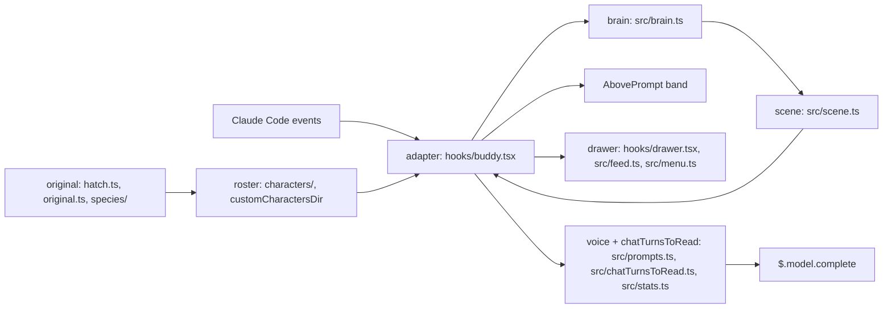

# buddy design

buddy is a Claude Code function-hooks plugin that draws a small ASCII character on the line above the prompt.
The character walks, rests, sleeps and reacts to tool calls and test runs, and it answers `/buddy` questions in one line through Claude Code's own model calls.
Characters are JSON files, seven shipped and any number of your own, and the personality picker can bring back the companion that Claude Code's removed `/buddy` hatched for your account.

## The designs

| Design | Covers |
| --- | --- |
| [Engine](./engine.md) | the band above the prompt, the tick, motion, the brain's states, particles, the speech bubble |
| [Characters](./characters.md) | the character contract, where characters come from, the line events, adding one |
| [Voice](./voice.md) | questions (a completion on the chat's last turns), `commentAfterEachTurn`, the second brain and the suggestion's use, steering by the user's rules, away mode (`promptWhenIdle`), the one-line rule and token caps, `model` |
| [chatTurnsToRead](./chatTurnsToRead.md) | `chatTurnsToRead`: the short-term memory, the chat's last turns with what the buddy and you said after each, kept per session, fed into every prompt |
| [Original companion](./original-companion.md) | recomputing the companion Claude Code hatched: identity, hash, PRNG, bones, species art, privacy, legal |
| [Drawer](./drawer.md) | `/buddy` alone: the conversation spanning the memory, the memory row, the full height, the personality picker's pane and groups, the live preview, the ctrl+x shortcuts, persistence, error lines |
| [Verification](./verification.md) | every gate and its broken state, the live proof row by row, the bugs the gates caught |

## How they fit together

One file talks to Claude Code: the adapter, [`plugins/buddy/hooks/buddy.tsx`](../../plugins/buddy/hooks/buddy.tsx).
It receives Claude Code's events, hands each one to a pure module under [`plugins/buddy/src/`](../../plugins/buddy/src/), and draws what comes back.
The modules never read the clock, the random source or a file themselves: the adapter passes them in, so a test drives every decision exactly.

- An event (a tool call, a turn ending, a command, a clock tick, a draw of the band) reaches the adapter, which calls one brain function.
- The brain changes state; the adapter asks it for the scene and redraws only when the scene differs from the last one drawn.
- Characters reach the brain through the roster. The original companion is one more roster entry, built from the account's roll and a species template.
- The drawer is the band opened: it draws the feed, which spans the memory; the personality picker, a pane ctrl+x t opens from it, is a second surface over the same roster.
- Voice, fed by the chatTurnsToRead, is the only path that calls a model.

## Rules every design keeps

| Rule | Why |
| --- | --- |
| Only the adapter touches `$`, passes it only to its top-level functions, and spells every call `$.noun.event(...)` | otherwise Claude Code loads the module with zero hooks; `npm run validate:plugin` reports it |
| Every hook catches, logs `{what} failed: {err}` on the transcript (`$.ui.log` through `notice()`, which names the plugin) and the plugin log, and returns `next(e)` or the original result | a broken buddy never blocks the prompt of everyone who installed it |
| An error never looks like "no buddy" | a bad character draws the duck with a bubble naming why; the personality picker says why inside the group |
| Only a question, the end-of-turn call while `commentAfterEachTurn`, `suggestNextPrompt` (the second brain) or `promptToMainChat` is on, or the away call while `promptWhenIdle` is on, calls a model | walking, reactions and every other command stay local and free |

## What persists

`$.store` survives `/reload` and restarts. The buddy's memory of each chat (`memory.json`: the turns, the memory items, the ended ones and each live rule's `strikes`; and `memory.md` beside it for you to read) and its round files (`saveRounds`) are kept in the chat's own folder beside its transcript ([chatTurnsToRead](./chatTurnsToRead.md#where-it-is-kept)); the only other file written is the plugin log (`logFile`, [Verification](./verification.md#logging)).

| Key | Holds | Written by |
| --- | --- | --- |
| `character` | the chosen character id | a pick in the personality picker (ctrl+x t, then Enter); picking the `character` option's own entry stores that id |
| `hidden` | `true` while hidden | `/buddy off`, `/buddy on` |
| `original` | the picked original's roll (`native` or `npm`) and its soul | a switch to a "Yours" original in the personality picker |
| `chatTurnsToRead:{session}` | before 1.0.0 only: a chat's memory, moved into its folder's `memory.json` when the chat is next opened | see [chatTurnsToRead](./chatTurnsToRead.md#where-it-is-kept) |

Every session shares one store, and Claude Code raises no event when it changes, so a session reads back what another may have written: `hidden` is read back while the band draws ([Engine](./engine.md#the-tick)).
