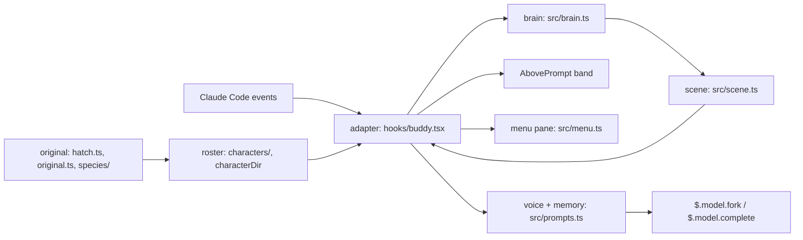

# buddy design

buddy is a Claude Code function-hooks plugin that draws a small ASCII character on the line above the prompt.
The character walks, rests, sleeps and reacts to tool calls and test runs, and it answers `/buddy` questions in one line through Claude Code's own model calls.
Characters are JSON files, seven shipped and any number of your own, and `/buddy-personality` can bring back the companion that Claude Code's removed `/buddy` hatched for your account.

## The designs

| Design | Covers |
| --- | --- |
| [Engine](./engine.md) | the band above the prompt, the tick, motion, the brain's states, particles, the speech bubble |
| [Characters](./characters.md) | the character contract, where characters come from, the line events, adding one |
| [Voice](./voice.md) | questions (a fork of the chat or a plain completion), quips, the one-line rule and token caps, the quip model |
| [Memory](./memory.md) | the short memory of recent exchanges, kept per session and per character, fed into every prompt |
| [Original companion](./original-companion.md) | recomputing the companion Claude Code hatched: identity, hash, PRNG, bones, species art, privacy, legal |
| [Personality menu](./personality-menu.md) | `/buddy-personality`: the groups, the live preview, Enter and Esc, persistence, error lines |
| [Verification](./verification.md) | every gate and its broken state, the live proof row by row, the bugs the gates caught |

## How they fit together

One file talks to Claude Code: the adapter, [`plugins/buddy/hooks/buddy.tsx`](../../plugins/buddy/hooks/buddy.tsx).
It receives Claude Code's events, hands each one to a pure module under [`plugins/buddy/src/`](../../plugins/buddy/src/), and draws what comes back.
The modules never read the clock, the random source or a file themselves: the adapter passes them in, so a test drives every decision exactly.

- An event (a tool call, a turn ending, a command, a clock tick, a draw of the band) reaches the adapter, which calls one brain function.
- The brain changes state; the adapter asks it for the scene and redraws only when the scene differs from the last one drawn.
- Characters reach the brain through the roster. The original companion is one more roster entry, built from the account's roll and a species template.
- The personality menu is a second surface over the same roster.
- Voice and memory are the only paths that call a model.

## Rules every design keeps

| Rule | Why |
| --- | --- |
| Only the adapter touches `$`, passes it only to its top-level functions, and spells every call `$.noun.event(...)` | otherwise Claude Code loads the module with zero hooks; `npm run validate:plugin` reports it |
| Every hook catches, logs `buddy: {what} failed: {err}` with `$.ui.log` and the plugin log, and returns `next(e)` or the original result | a broken buddy never blocks the prompt of everyone who installed it |
| An error never looks like "no buddy" | a bad character draws the duck with a bubble naming why; the menu says why inside the group |
| Only a question, or a quip when quips are on, calls a model | walking, reactions, petting and every other command stay local and free |

## What persists

`$.store` survives `/reload` and restarts; the only other file written is the plugin log (`logFile`, [Verification](./verification.md#logging)).

| Key | Holds | Written by |
| --- | --- | --- |
| `character` | the chosen character id | Enter in `/buddy-personality`; picking the `character` option's own entry stores that id |
| `hidden` | `true` while hidden | `/buddy off`, `/buddy on` |
| `pets` | the pet count | `/buddy` |
| `original` | the picked original's roll (`native` or `npm`) and its soul | Enter on a "Yours" row in the menu |
| the memory's keys | recent exchanges, per session and character | see [Memory](./memory.md) |

Every session shares one store, and Claude Code raises no event when it changes, so a session reads back what another may have written: `/buddy` counts on from the stored `pets`, and `hidden` is read back while the band draws ([Engine](./engine.md#the-tick)).
