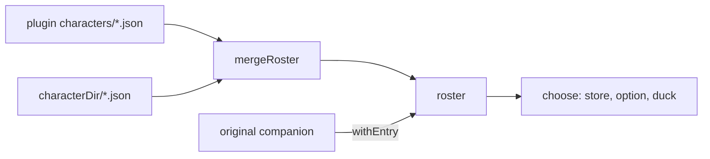

# Characters

A character is data, not code: one JSON file holding a persona, a few poses of ASCII art and some lines.
Anyone can draw one in a folder of their own, and nothing in it runs.

## The contract

One JSON object per file, `{id}.json`, the file name equal to `id`.
[`schema/character.schema.json`](../../plugins/buddy/schema/character.schema.json) states the contract for editors; `validateCharacter` enforces it at load.

| Field | Type | Required | Meaning |
| --- | --- | --- | --- |
| `$schema` | string | no | `"../schema/character.schema.json"` in the shipped ones |
| `id` | `^[a-z0-9][a-z0-9-]{0,31}$` | yes | the name `/buddy-personality` stores; equals the file name |
| `name` | string, 1 to 40 | yes | display name |
| `description` | string, 1 to 100 | yes | one line for the menu's preview and the hover card |
| `author` | string, up to 60 | no | credit |
| `persona` | string, 1 to 1200 | yes | the voice prompt, in the second person ("You are …") |
| `color` | an Ink color name or `#rrggbb` | no | the sprite's color, `yellow` by default |
| `poses` | pose name to frames | yes | a frame is an array of rows |
| `lines` | line event to a pool of one-liners, each up to 120 characters | no | what it says, by event |
| `motion` | `walk`, `stepMs` (80 to 1000), `restChance` (0 to 0.2), `restTicks` (1 to 100) | no | defaults `true`, 200, 0.02, 15 (`DEFAULT_MOTION`) |

Rows are printable ASCII (0x20 to 0x7E), at most 16 columns (`MAX_COLS`), a frame at most 6 rows (`MAX_ROWS`).
The loader pads every row to the character's widest and bottom-aligns every frame to its tallest (`normalizeFrames`), so the feet stay on the line.
An unknown field, pose or line event makes the file invalid, and the error is the first problem found, named by its path: `poses.idle[0][1]: at most 16 columns (has 17)`.

A missing pose draws the next one along its chain (`POSE_FALLBACK`), so three poses make a complete character:

| Pose | Required | Falls back to | Drawn when |
| --- | --- | --- | --- |
| `idle` | yes | | standing |
| `walkRight` | while `motion.walk` is true, 2+ frames | `idle` | walking right |
| `walkLeft` | no | `walkRight` | walking left |
| `rest` | no | `idle` | a pause in the walk |
| `oops` | no | `idle` | a tool or a test failed; a question failed |
| `yay` | no | `idle` | a test passed; a quip on a turn with no failures |
| `thinking` | no | `idle` | a question is running |
| `petted` | no | `yay` | `/buddy` |
| `working` | no | `idle` | Claude is working |
| `sleep` | no | `rest` | asleep, midnight to 6 am |

## Where characters come from

| Source | Where | Marked |
| --- | --- | --- |
| Shipped (`builtin`) | the plugin's `characters/`: `cat`, `dragon`, `duck`, `ghost`, `professor`, `robot`, `yellow-duck` | |
| Your folder (`user`) | the folder the `characterDir` option names; `~` expands to HOME | the menu's Your folder group |
| Original (`original`) | built from the account's roll and a species template, id `original`, reserved: a character file with that id is refused with an error naming the file, said in the menu's Your folder group, the log, and the bubble at each session start and `/buddy reload` (`mergeRoster`, `startWarning`) | [Original companion](./original-companion.md) |

A file is a candidate when it is a visible `.json` entry that is not a folder (`isCharacterFile`).
The roster keeps every candidate, valid or not, sorted by id; an id in both folders is taken from yours.
An invalid file stays in the roster with its first error, so `/buddy-personality` lists it as `{id} (invalid)`, its preview naming the error, rather than hiding it.
A folder that cannot be listed is logged, named in the menu's group, and said in the bubble at each session start and `/buddy reload` (`startWarning`).
The roster loads at session start and again on `/buddy reload`.

The character drawn is chosen in order (`choose`): the stored choice (Enter in `/buddy-personality`), then the `character` option, then `duck` (`DEFAULT_ID`).
A missing or invalid choice draws the duck with a bubble `Couldn't load {id}: {why}; /buddy-personality picks another` for 10 seconds, and the log says it too.
If `duck.json` itself fails, a minimal stand-in duck compiled into the engine (`STANDIN_DEFAULT`) draws, so an error always has a buddy to say it.

## Line events

A pool is the character's own; a missing `wake` pool borrows its `greeting`; anything else missing falls back to a short, neutral pool (`GENERIC_LINES`), never to another character's voice.
A line is never the one said last from the same pool (`pickLine`).

| Event | Fires when | Chance | Shows for |
| --- | --- | --- | --- |
| `greeting` | a character is set with nothing to warn about (no load error, no roster error, no first-time option warning; `startWarning`): session start, `/buddy reload`, Enter in the menu; and `/buddy on` | always | 6 s |
| `toolFail` | a finished tool call was denied, or failed without reading like a test failure | always | 6 s |
| `testPass` | a Bash call's output matches the pass pattern and not the fail one, and the call did not fail | always | 6 s, with confetti |
| `testFail` | a Bash call's output matches the fail pattern | always | 6 s |
| `petted` | a bare `/buddy` | always | 6 s |
| `thinking` | a `/buddy` question starts | always | until the answer, the failure or the question's deadline (90 s) |
| `rest` | the tick a walking rest begins | 1 in 4 | 6 s |
| `working` | `isWorking` turns true while no bubble shows | 1 in 4 | 6 s |
| `wake` | the first event after sleep: a tool call, `/buddy` (a pet or a question), a turn ending, work starting | always | 6 s, unless the waking event says its own line at once (a pet, a question, a tool reaction), which replaces it |
| `farewell` | `/buddy off` | always | never in a bubble: it is the command's reply, since the band hides at once |

An original companion's pools come from its species template, with `{name}` filled in.

## How a contributor adds one

1. Write `{id}.json` in a folder of your own; [`CONTRIBUTING.md`](../../CONTRIBUTING.md) has a working example.
2. Point `characterDir` at the folder and start a session. `/buddy-personality` lists it under Your folder, or as `{id} (invalid)` with the first error in its preview.
3. Enter on it in the menu draws it. Edit, save, `/buddy reload`. Try a narrow window too.
4. To ship it: add it to `plugins/buddy/characters/` with the relative `$schema`, add a row to the README's Characters table, run the checks, and open a pull request against `develop`.

A shipped character is original work (no copied character, trademark or real person), friendly, not a recolour of one already built in, and MIT-licensed.

## Decisions

- **Data, not code.** Rejected: characters as plugin modules. A JSON file cannot run anything, so a shared character is safe to try.
- **The first error, by its path.** Rejected: a list of every problem. An author fixes one precise thing at a time, and the validator stays small.
- **Unknown fields are invalid.** Rejected: ignoring them. A typo such as `walkright` would otherwise vanish silently.
- **Invalid files stay listed.** Rejected: dropping them. A file that disappears reads as "buddy did not find it"; a named error reads as what it is.
- **Printable ASCII only.** Rejected: Unicode art. A wide character takes two columns, and an ambiguous-width one one or two as the terminal's font decides, so art that lines up in one terminal breaks in another. Only an original companion's eyes (`· ✦ × ◉ °`) use them, and the `ambiguousWidth` option measures those.
- **The loader pads and bottom-aligns.** Rejected: requiring exact widths. Authors never count trailing spaces. (Species templates do require exact widths: their eye and hat slots sit at fixed columns.)
- **A fallback chain for poses.** Rejected: requiring all ten. A small character is complete with `idle` and a walk.
- **A neutral fallback pool.** Rejected: the duck's lines as the default for every character. No character ever speaks in another's voice.
- **Your file wins an id.** Rejected: the shipped one winning. It lets you restyle a shipped character without editing the plugin. The one id no file takes is `original`: a file could otherwise stand in for your original companion.
- **A stand-in compiled in.** Rejected: drawing nothing when `duck.json` fails. The error needs a buddy to say it.

## Where it lives

| File | Symbols |
| --- | --- |
| [`src/character.ts`](../../plugins/buddy/src/character.ts) | `validateCharacter`, `normalizeFrames`, `parseLines`, `framesFor`, `frameAt`, `POSES`, `LINE_EVENTS`, `POSE_FALLBACK`, `DEFAULT_MOTION`, `MAX_COLS`, `MAX_ROWS`, `MAX_LINE`, `INK_COLORS` |
| [`src/roster.ts`](../../plugins/buddy/src/roster.ts) | `isCharacterFile`, `loadEntries`, `mergeRoster`, `withEntry`, `choose`, `STANDIN_DEFAULT`, `DEFAULT_ID` |
| [`src/lines.ts`](../../plugins/buddy/src/lines.ts) | `GENERIC_LINES`, `poolFor`, `pickLine` |
| [`hooks/buddy.tsx`](../../plugins/buddy/hooks/buddy.tsx) | `readDir`, `loadRoster`, `applyChoice` |
| [`src/options.ts`](../../plugins/buddy/src/options.ts) | `expandHome` |
| [`schema/character.schema.json`](../../plugins/buddy/schema/character.schema.json) | the JSON Schema, draft 2020-12 |

## How it's tested

- Unit: [`tests/character.test.ts`](../../tests/character.test.ts) (defaults, padding, first error by path, pose fallback), [`tests/roster.test.ts`](../../tests/roster.test.ts) (candidates, invalid entries, your file wins, choice order, the stand-in), [`tests/lines.test.ts`](../../tests/lines.test.ts). They use inline fixtures ([`tests/fixtures.ts`](../../tests/fixtures.ts)), never the shipped files.
- Hooks: the band draws the stored character, defaults to the duck, and says why for an invalid or unknown choice, pointing at `/buddy-personality`.
- Live: rows (a), (c), (g) and (i) load shipped files for real: the duck, the first other character by id (`cat` today, also the menu's pick), and the one listed after the duck.
- Shipped files: `tests/character.test.ts` names the seven shipped characters and runs each through `validateCharacter`, as `tests/species.test.ts` does for the species templates, so a broken shipped file fails the suite before it can show as `(invalid)` in the menu.
