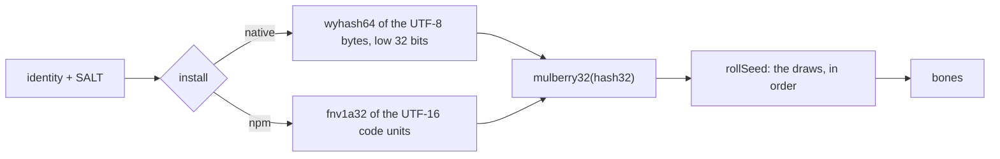

# Original companion

In April 2026 Claude Code shipped `/buddy`, a companion hatched once per account, and version 2.1.97 removed it; people miss theirs.
buddy brings each one back: it recomputes the companion's body from the account and reads its saved name and personality, and draws it with buddy's own art.

## Body and soul

A companion has two halves, and they come back by different roads:

| Half | Holds | Where it comes from |
| --- | --- | --- |
| bones | rarity, species, eye, hat, shiny, five stats | recomputed: a pure function of the account's identity, never stored anywhere |
| soul | name, personality, hatch date | read: the `companion` field of Claude Code's config (`~/.claude.json`, or `$CLAUDE_CONFIG_DIR/.claude.json`), or of a backup of it |

## Identity to bones



The identity is the account's `oauthAccount.accountUuid`, else its `userID`, else `anon` (`identityOf`).
The salt, `SALT`, is appended, the result is hashed to 32 bits, and the hash seeds a small PRNG whose floats in [0, 1) make every draw.
The order of the draws is the contract (`rollSeed`):

```text
next      = mulberry32(hash32(identity + SALT, install))
rarity    = weighted(next() * 100)          # common 60, uncommon 25, rare 10, epic 4, legendary 1
species   = pick(SPECIES)                   # 18, in a fixed order
eye       = pick(EYES)                      # 6 glyphs
hat       = rarity is common ? none         # a common draws nothing here
                             : pick(HATS)
shiny     = next() < 0.01
peak      = pick(STATS)
dump      = pick(STATS), again while dump == peak
for stat in STATS, in order:
  peak -> min(100, floor + 50 + int(next() * 30))
  dump -> max(1,   floor - 10 + int(next() * 15))
  else ->          floor      + int(next() * 40)
seed      = int(next() * 1e9)               # drawn to match; nothing uses it
```

`pick(list)` is `list[int(next() * length)]`, and `floor` is the rarity's stat floor: 5, 15, 25, 35, 50 (`STAT_FLOOR`).

### Two installs, two companions

The native install ran on Bun, whose `Bun.hash` is wyhash; the npm install ran on Node, which hashed with FNV-1a.
The same account therefore hatched two different companions, depending on how Claude Code was installed; across the 300 test identities the two agree on the species fewer than one time in five.
buddy cannot know which install hatched yours, so the menu lists both, `{name} — native install` and `{name} — npm install`, and the live preview lets you recognise yours.
The plugin runtime has no Bun, so `wyhash64` is a port in `BigInt` of the final wyhash revision (the one Zig's `std.hash.Wyhash` implements).

### The traps

Each of these moves every later draw when a port gets it wrong:

- **A common draws no hat, and consumes no draw.** Drawing a hat and discarding it shifts shiny, the stats and the seed for 60% of accounts.
- **The dump stat re-draws until it differs from the peak.** The number of draws varies; skipping to the next stat instead drifts.
- **The stats draw in the fixed `STATS` order**, one draw each, after the peak and the dump.
- **The two hashes read different units.** wyhash reads UTF-8 bytes, with a lone surrogate encoded as U+FFFD (`utf8`); FNV-1a reads UTF-16 code units.
- **wyhash's block loop stops while more than 48 bytes remain**, so every input of 1 to 48 bytes reaches the tail; each length range takes its own branch.

## The proof

The port is proven against the original, not against itself:

| Fixture | Holds | Checked by |
| --- | --- | --- |
| [`hatch-wyhash.json`](../../tests/fixtures/hatch-wyhash.json) | 300 vectors from running Claude Code 2.1.96's own functions under Bun: `anon`, the empty string, generated UUIDs and hex ids | every field of `roll(id, 'native')` equal: the hash, the bones, the seed |
| [`hatch-fnv.json`](../../tests/fixtures/hatch-fnv.json) | the same 300 under Node | every field of `roll(id, 'npm')` equal |
| [`wyhash-bun.json`](../../tests/fixtures/wyhash-bun.json) | 323 strings hashed by `Bun.hash` itself, from 0 to 200 bytes, the 48, 96 and 144 block edges, multi-byte UTF-8 | `wyhash64` equal in all 64 bits and the low 32 |

The vectors cover every rarity, a hat on a non-common and none on every common.
[`scripts/gen-wyhash-fixture.mjs`](../../scripts/gen-wyhash-fixture.mjs) regenerates the Bun cross-check with a seeded generator, so the file is stable; it refuses to run outside Bun.

## The art

A species template, `species/{species}.json`, is the sprite with blanks the engine fills in:

| Field | Rule |
| --- | --- |
| `species` | one of the 18, equal to the file name |
| `width` | 1 to 12; every row of every frame is exactly this wide, `{E}` counted as one column |
| `hatCol` | the column the hat centers on, below `width` |
| `poses` | `idle` (3+ frames: base, fidget, blink), `walkRight` (2+), `oops`, `yay`, `sleep` required; the other poses optional |
| a frame | row 0 is the hat row, all spaces; then 1 to 4 body rows of printable ASCII |
| `{E}` | an eye; blink and sleep frames draw `-` instead |
| `lines` | the character line events, `{name}` becoming the companion's name |

`species/hats.json` maps each hat but `none` to one row of at most 7 columns; all seven drawings are buddy's own.
[`schema/species.schema.json`](../../plugins/buddy/schema/species.schema.json) states the contract; `validateSpecies` and `validateHats` enforce it.

Wearing the bones (`originalCharacter`, `wearFrame`): row 0 becomes the hat centered on `hatCol` and kept inside the width, or is dropped with no hat; every `{E}` becomes the rolled eye.
The sprite takes its rarity's color (`RARITY_COLOR`: white, green, blue, magenta, yellow).
A shiny one adds a sparkle column, its `*` alternating rows frame by frame, and cycles through the rainbow, one color every 200 ms (`spriteColor`).
The persona joins the soul's name and personality, the rarity and species, and a line from its strongest and weakest stats (`personaOf`, `statsHint`).
The personality picker's preview shows the species, stars and shiny, five stat bars (`SNARK     ████████░░ 81`) and the hatch date (`cardOf`).

## Finding the soul

Claude Code's config is read first: `$CLAUDE_CONFIG_DIR/.claude.json` when `CLAUDE_CONFIG_DIR` is set, else `~/.claude.json` (`configSources`).
With `CLAUDE_CONFIG_DIR` set, the files under HOME are another account's and are never looked at.
Without a companion in the config, buddy lists its backups in two places: beside the config (`.claude.json.backup`, `.backup.{n}`, `.bak`, `.bak-*`, `.pre-*`), and in `$CLAUDE_CONFIG_DIR/backups/` or `~/.claude/backups/` (`.claude.json.backup.*`, what Claude Code writes there).
It keeps real backup names only, never an unfinished write (`.tmp.*`), a folder, an empty file or one over 5 MB, then the newest 10 by modification time (`backupCandidates`, `BACKUP_LIMITS`), and takes the first of those that parses and holds a companion (`backupSoul`); the menu names that backup.
A companion in the config that is present but malformed is an error, said as one, never "none"; backups that would not read or parse are counted and said, and each file left out is logged at `debug` by name with why.

Once picked, the soul and which install's roll you chose, native or npm, are saved (`SavedOriginal`).
A restart reads the config again only for the identity, re-rolls, and draws, with no backup scan (`restoreOriginal`).

Nothing is ever hatched by a model.
The bones can be recomputed; the soul cannot: it was chosen once, when the companion hatched.
A model could invent a name and a personality, but that would be a stranger wearing your companion's body.
No soul found means no "Yours" entry, said in one line.

## The privacy line

- The identity is read to be hashed, and is never shown, saved or logged. A saved pick holds the soul and the roll, never the identity.
- The config and its backups are only listed, dated and read; buddy never writes them.
- An error names the file and the kind of failure, never the parser's message, which can quote the file (`readJson`).
- The menu shows the config and its backups as `~/…` or `$CLAUDE_CONFIG_DIR/…`, never an absolute path.

## The legal line

Only the algorithm is reimplemented: the salt, the hashes, the PRNG, the draw order and the tables the draws index.
Those are functional facts, needed to get the same companion back.
Every sprite, hat, line and persona text is buddy's own, and no Claude Code source is copied.

## Decisions

- **Recompute the bones.** Rejected: asking you to describe your companion. The recomputation is exact, stats and eye included.
- **Port wyhash.** Rejected: calling `Bun.hash`. The plugin runtime has no Bun.
- **List both installs.** Rejected: guessing one. A wrong guess gives you a stranger.
- **The soul only from the file or a backup.** Rejected: hatching a new soul with a model.
- **The newest backup that holds a companion.** Rejected: the newest backup. A backup written after the removal may hold none.
- **The config directory Claude Code uses.** Rejected: always HOME. With `CLAUDE_CONFIG_DIR` set, HOME's `.claude.json` is another account's, and its companion would be a stranger.
- **Real backup names, the newest 10.** Rejected: every `.claude.json.*` file. An unfinished `.tmp.*` write, an empty file or a huge one is read for nothing, and a long backup history would be read in full at every open.
- **Save the soul and the roll, not the identity.** Rejected: saving nothing, which rescans backups at every start; and saving the identity, which is private.
- **One template per species, with slots.** Rejected: a drawing per combination of species, eye and hat. 18 templates and one hat file cover them all.
- **Exact widths in templates.** Rejected: padding as characters do. The hat and the eyes sit at fixed columns.

## Where it lives

| File | Symbols |
| --- | --- |
| [`src/hatch.ts`](../../plugins/buddy/src/hatch.ts) | `SALT`, `SPECIES`, `EYES`, `HATS`, `STATS`, `RARITY_WEIGHTS`, `STAT_FLOOR`, `utf8`, `wyhash64`, `fnv1a32`, `hash32`, `mulberry32`, `rollSeed`, `roll` |
| [`src/original.ts`](../../plugins/buddy/src/original.ts) | `identityOf`, `companionOf`, `soulOf`, `newestFirst`, `originalCharacter`, `wearFrame`, `personaOf`, `cardOf`, `RARITY_COLOR`, `SavedOriginal`, `savedOriginalOf` |
| [`src/config-source.ts`](../../plugins/buddy/src/config-source.ts) | `configSources`, `backupCandidates`, `BACKUP_LIMITS` |
| [`src/species.ts`](../../plugins/buddy/src/species.ts) | `validateSpecies`, `validateHats`, `EYE_TOKEN`, `SPECIES_REQUIRED_POSES` |
| [`src/scene.ts`](../../plugins/buddy/src/scene.ts) | `spriteColor`, `RAINBOW` |
| [`hooks/buddy.tsx`](../../plugins/buddy/hooks/buddy.tsx) | `sourcesOf`, `readConfig`, `readJson`, `backupSoul`, `loadArt`, `rollOriginal`, `findOriginals`, `restoreOriginal` |

## How it's tested

- Unit: [`tests/hatch.test.ts`](../../tests/hatch.test.ts) (the 300 + 300 vectors, the Bun cross-check, the pieces), [`tests/config-source.test.ts`](../../tests/config-source.test.ts) (the config and backup places, backup names, the newest 10), [`tests/original.test.ts`](../../tests/original.test.ts) (identity, soul, backups, the worn frame, shiny, the card, the persona, the saved pick), [`tests/species.test.ts`](../../tests/species.test.ts) (the validator, the schema agreeing with it, all 18 shipped templates and `hats.json`).
- Hooks: the "personality pane" group feeds an invented `~/.claude.json` and backups from memory, and checks that no file is written and that the identity appears in no log line and no stored value.
- Live: none. The live proof keeps the real HOME ([Verification](./verification.md)).
