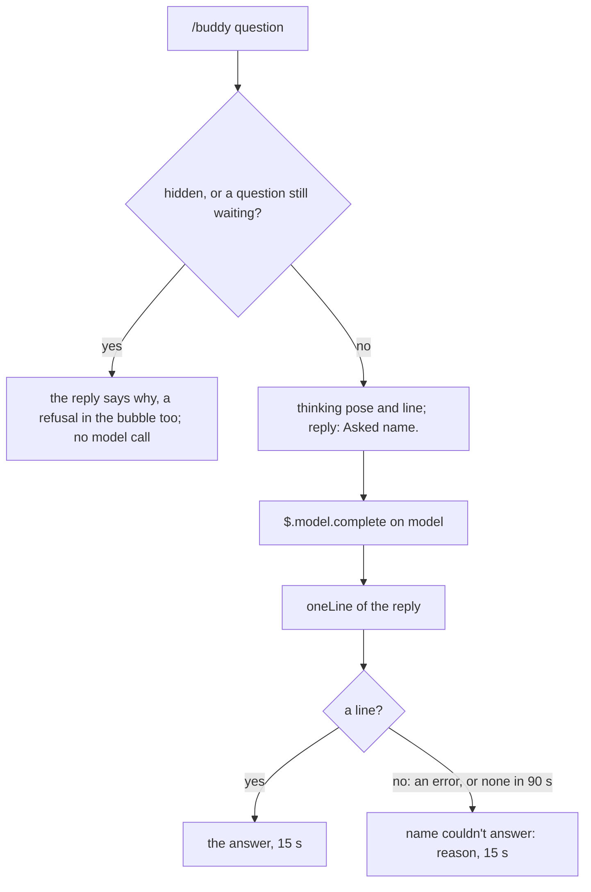

# Voice

buddy talks through a model in exactly two ways: it answers a question you ask with `/buddy`; and at the end of every answered turn one call writes its reaction to the turn (`commentAfterEachTurn`) and your next prompt (`suggestNextPrompt`), both on by default.
Everything else it says is a canned line ([Characters](./characters.md)), and every model reply is held to one bubble line and a few tokens.

## Questions

`/buddy` followed by anything that is not a command is a question.
Asked for a prompt ("put it in a prompt for me"), the answer adds a line `SUGGEST_NEXT_PROMPT: {prompt}` (`ASKED_PROMPT_RULE`); `parseAskReply` takes it off the answer, and `putAskedPrompt` puts it in the prompt box and in the drawer as the idea ctrl+x u uses. A turn running then leaves it in the drawer alone; one past `ASKED_PROMPT_MAX_CHARS` (600) is said in the bubble and the drawer, never put.
A command word counts only when it stands alone, so `/buddy reload the page` is a question, not `/buddy reload` (`parseCommand`).
`/buddy list` alone, or `/buddy use` with one word after it, is no question either: switching moved to the drawer's personality tab, and the reply is `Switching characters moved to the drawer's personality tab: /buddy opens it.`, with no model call. `/buddy` alone opens the drawer, no question either.



`$.model.complete` runs on `model` at `effort`, with the persona, the character rule, the memory rule (`memoryRule`: its memory reaches the last `chatTurnsToRead` turns, and anything older it says it doesn't remember, never guessing) and the one-line rule as the system prompt (`oneLineSystem`), and the buddy's memory ([chatTurnsToRead](./chatTurnsToRead.md)) and the question as the prompt (`questionPrompt`), capped at 2048 output tokens (`QUESTION_MAX_TOKENS`), thinking included.
It does not see the rest of the chat, and it answers at once, even while the main turn runs.

The command replies `Asked {name}.` at once, and the model call runs after the handler returns; the `thinking` line holds the bubble meanwhile, until the answer, the failure or the deadline arrives.
A question has 90 seconds (`COMPLETE_DEADLINE_MS`).
The answer replaces the `thinking` line for 15 seconds.
A question the model answers with no words is asked once more while at least 10 seconds of its deadline remain (`retriesEmpty`, `RETRY_MIN_MS`; the log's `ask.retry`, and `ask.outcome` counts both calls, and the first's usage whatever the retry does, a timeout or a throw included). A call that fails or answers nothing, or a question past its deadline (`no answer in 90 s`), shows `{name} couldn't answer: {reason}` with the `oops` pose, and the log names the reason (`noAnswerReason`): `api-error` carries its status (`api-error 529`), `empty-reply` and `aborted` read as themselves.
The deadline ends the question in the bubble; the completion's own `timeoutMs` (`requestTimeoutMs`: the time left before the deadline when it is sent, plus 5 seconds) makes the engine abandon the request 5 seconds past the deadline, however late it was sent. One deadline, from the question's start, covers the `chatTurnsToRead` read, the settings and the completion.
The answer belongs to the character asked: when another is drawn by the time it arrives, the answer or the failure is dropped, never said by the new one, and the log says `{name}'s answer was dropped: {drawn} is drawn now`.
One question waits at a time: one asked meanwhile is refused out loud, in the reply and the bubble (`{name} is still thinking about your last question`).
An answer, a failure or a refusal holds the bubble for its time; tool-call reactions and other unasked lines wait.

## The end-of-turn call

`commentAfterEachTurn` and `suggestNextPrompt` are on by default (`commentAfterEachTurn: true`, `suggestNextPrompt: true`); each turns off alone.
At the end of every turn (`turn.complete`), the brain resets the turn's tally and returns it with whether `commentAfterEachTurn` is due (`endTurn`): `commentAfterEachTurn` on, and at least `secondsBetweenComments` seconds (0 by default: every turn) of brain time since the last `commentAfterEachTurn`.
The call is made only for an answered turn of the main loop (`reason: 'answer'`, not aborted, no `agentId`), tool use or not, while the buddy is shown, when `commentAfterEachTurn` is due or `suggestNextPrompt` is on.
It is one `$.model.complete` on `model` at `effort`, at most 2048 output tokens, thinking included (`TURN_MAX_TOKENS`), within 30 seconds (`TURN_DEADLINE_MS`): about 3 seconds.
A call that cannot answer (an API error, an empty reply, the deadline) fails `commentAfterEachTurn` and gives `suggestNextPrompt` up to the engine's own suggestion; a reply arriving after a later main turn ended, however it ended, or after a `/clear` or a resume, is stale (`turnGen`): its `commentAfterEachTurn` and `suggestNextPrompt` are never shown.
The call speaks as the character drawn when the turn ended: a `commentAfterEachTurn` arriving after a switch is dropped, never said by the new one.
`commentAfterEachTurn` is asked for only once the band has drawn in the session (`turnMay`); before that the call writes `suggestNextPrompt` alone.
Each turn is filed under its `turnId` with the prompt that started it, as `turn.start` carries it (`startPromptTurn`, `endPromptTurn`); `prompt.submit` supplies its origin (`submitPrompt`, `isUserOrigin`), so a peer message or task notification delivered into a running turn never takes the next turn's prompt, and a turn not started by the user is filed as such. The user's own origins are the terminal, Remote Control, an SDK host, the owner's Slack ping and a follow-up to the user's own action; a turn whose submission was never seen, or that the engine could not place, is shown as of unknown origin. A submission never matches the turn it was typed over, and a prompt that started no turn is dropped at the next turn's start, never handed to a later one. The running turn's marker and its prompt clear at every main `turn.complete`, before the hooks beneath it run and whether or not a character is loaded (`onTurnEnd`). Only an answered turn with a person at the prompt is filed into the `chatTurnsToRead` ([chatTurnsToRead](./chatTurnsToRead.md)), before the end-of-turn call reads it. A `/clear` or a resume (`session.end`, `endsConversation`) moves the process to another session id, and with it to another `chatTurnsToRead`; it empties the prompts, and a `/buddy` question asked before it is dropped, never shown or remembered, however its call ends, a throw included.
`parseTurnReply` reads the reply, and `commentAfterEachTurn.outcome` carries the call's usage (`usageFields`: `inTok`, `cacheRead`, `cacheWrite`, `outTok`, `cachePct`) and `ms`, from the turn's end to the reply, as `suggestNextPrompt.outcome` does; when the call wrote no `commentAfterEachTurn`, `suggestNextPrompt.outcome` carries the usage instead.
The system prompt is the persona, the character rule when a `COMMENT_AFTER_EACH_TURN:` is wanted, then the tagged lines wanted (`turnSystem`): `COMMENT_AFTER_EACH_TURN:` the buddy's own reaction in character, at most 20 words; `SUGGEST_NEXT_PROMPT:` the prompt the user is most likely to send Claude next, in the user's own words, at most 15 words, `SUGGEST_NEXT_PROMPT: NONE` only when the work is plainly finished.
The prompt is the `chatTurnsToRead` (the last `chatTurnsToRead` answered main-thread turns, 4 by default, 1 to 10, oldest first, each the prompt its `turn.start` carried, the user's or not, what Claude did, and Claude's answer, filtered as [chatTurnsToRead.md](chatTurnsToRead.md) says, with what the buddy and the user said after each; the turn just ended is the last), then the turn's tally (`turnPrompt`):

```text
What you remember, oldest first:

Turn 1. The user asked Claude:
run the tests
Claude answered:
All 42 pass.

In the turn that just ended: Tools used: Read x3, Bash. Failures: 1. Last shell command: npm test.
```

`parseTurnReply` reads the `COMMENT_AFTER_EACH_TURN:` and `SUGGEST_NEXT_PROMPT:` lines in any case, bullets tolerated; an untagged reply is `commentAfterEachTurn` alone.

### commentAfterEachTurn

`commentAfterEachTurn` goes through `oneLine` and shows with `yay` when the turn had no failures, `oops` when it had some.
A `commentAfterEachTurn`, or its failure, that arrives while a `/buddy` answer, its failure, a refusal or the `thinking` line still holds the bubble (`holdsAnswer`) is not said and not remembered; the log records it as `held` (`commentAfterEachTurn.outcome`). The previous turn's `commentAfterEachTurn` never holds against the next one, which replaces it; a line nobody asked for waits behind either.
A call that fails, times out or has no `commentAfterEachTurn` fails it as a question fails, in the bubble.

### suggestNextPrompt

The persona decides what to nudge toward; the words are never in character.
`SUGGEST_NEXT_PROMPT:` goes through `suggestNextPromptText`, which strips wrapping quotes and collapses whitespace; `NONE`, an empty value or one past 160 characters (`SUGGEST_NEXT_PROMPT_MAX_CHARS`) proposes nothing.
`suggestNextPrompt` becomes the prompt box's dim suggestion through `$.prompt.suggest`; a late one is safe, since Claude Code refuses it once the box holds text or a turn runs.
A `suggestNextPrompt` overtaken by a later turn's start or end, a `/clear` or `/buddy off` is stale and never proposed.
While `suggestNextPrompt` is on and the buddy is shown, the `prompt.suggest` hook holds back Claude Code's own guess (origin `suggestion`, `dropsHarnessSuggestion`), so it never covers the buddy's; a plugin's proposal, the buddy's or another's, always passes.
When the buddy gives up on a turn (timeout, no answer, `NONE`, an error), or a turn makes no call of its own, the held guess is proposed after all, and one arriving later passes: the box is never emptier than without the plugin.
Claude Code's own suggestions still cost their own call: turning them off saves paying for both.
The log records each outcome at info (`suggestNextPrompt.outcome`: shown, not-shown, none, failed, stale; and for the engine's held suggestion harness-shown, harness-not-shown, harness-replaced when the buddy's own was shown instead, harness-hidden when the buddy was hidden, harness-stale when a later turn started or the conversation ended first: `heldSuggestionRelease`), and at debug only lengths, never the prompt or the `suggestNextPrompt`.

## One line, few tokens

Every model reply must fit one bubble.
Three layers hold it there:

| Layer | What it does | Where |
| --- | --- | --- |
| The one-line rule | `Answer in ONE line, at most 25 words, in character. Do not use tools. Do not think out loud.`, in every question's system prompt | `ONE_LINE_RULE` |
| A token cap | 2048 output tokens for a question and for the end-of-turn call: the model's thinking counts against it, so a tight cap cut answers short or left none; the rules keep the text to one line | `QUESTION_MAX_TOKENS`, `TURN_MAX_TOKENS` |
| The trim | the first non-empty line, quotes and backticks stripped, never cut: what the buddy says to you is kept whole, in the bubble, the memory and the drawer | `oneLine` |

The rule exists because a model's reply, without it, spent 813 output tokens on what should have been one line.
Each clause closes one way a working chat's model spends tokens: length, tools, thinking out loud.
The rule makes the model aim for one line; the cap and the trim catch the rest.

## `model` and `effort`

`model` (default `opus`) is an alias such as `opus`, `sonnet` or `haiku`, or a full model id; `effort` (default `low`; low, medium, high, xhigh or max) is how hard it thinks on each call, passed to every `$.model.complete` the buddy makes.
Either can be `inherit`, resolved before every call by `callSettings`: `model: inherit` is the main chat's model (`$.session.model()`, `resolveModel`), `opus` when it cannot be read; `effort: inherit` is the effort of the main chat's latest model request, which the `turn.step` hook records for every main-loop step (`observeEffort`; a subagent's step leaves it) and passes through untouched; a level is sent as it is, and a number, a request without effort, or no request yet sends none (`resolveEffort`), so the model's default applies. A failed model read is logged once and falls back; each call's resolved model and effort are logged at debug (`turn.settings`, `ask.settings`), and `session.start` logs the options as set, `inherit` included.
It serves both calls: the end-of-turn call and every question.
A question it answers carries the `chatTurnsToRead` before the question, since a completion cannot see the chat.
Like every option, it is resolved once at load by `resolveOptions`: a value of the wrong type is ignored by name (`option model ignored: not a string`), logged at session start, said once in the first greeting's bubble, and listed under `/buddy help`.

## Decisions

- **A question answered by `model` on the last turns.** Rejected: a completion blind to the chat, which answers nothing useful about the work. The chat's last `chatTurnsToRead` turns tell it where the chat stands, and it answers in about 3 seconds, even mid-turn.
- **A 90-second safety net.** Rejected: no deadline. The deadline guarantees the bubble ends; the request's `timeoutMs`, just past it, abandons the call, so one timer decides the reason.
- **The rule in the prompt, and a cap, and a trim.** Rejected: a token cap alone, which cuts a rambling answer mid-sentence. The rule shapes the answer; the cap bounds the cost; the trim guarantees one line.
- **Reply at once, answer later.** Rejected: holding the command until the model answers. The prompt stays free, and the bubble shows the buddy thinking.
- **One call per turn for `commentAfterEachTurn` and `suggestNextPrompt`, on by default.** Rejected: a separate call for `suggestNextPrompt` beside `commentAfterEachTurn`'s. One call reads the turn once and bounds its cost with one token cap; and a buddy that spoke only after tool use, past `secondsBetweenComments`, spoke too little.
- **Every call sees the ends of the last `chatTurnsToRead` turns, not the whole chat.** Rejected: a summary alone, which cannot tell what the user will ask next; and replaying the main chat's whole request, which sees everything but in a long session answers after about a minute, cannot be cancelled, takes no token cap, and mid-turn would only continue the main turn. A companion's aside has to be fast, so both calls run on `model`, with no option to choose another path.
- **`suggestNextPrompt` in the user's words.** Rejected: a `suggestNextPrompt` in character, which would have to be rewritten before sending, which defeats Tab.
- **A failure shows in the bubble.** Rejected: staying silent. An empty bubble would read as "it did not hear me".
- **Command words only when alone.** Rejected: matching the first word. `/buddy reload the page` is a question.

## Where it lives

| File | Symbols |
| --- | --- |
| [`src/prompts.ts`](../../plugins/buddy/src/prompts.ts) | `ONE_LINE_RULE`, `QUESTION_MAX_TOKENS`, `TURN_MAX_TOKENS`, `TURN_DEADLINE_MS`, `oneLineSystem`, `memoryRule`, `questionPrompt`, `CHARACTER_RULE`, `turnSystem`, `turnPrompt`, `parseTurnReply`, `oneLine`, `lostThread`, `stillThinking`, `TurnSummary`, `suggestNextPromptText`, `SUGGEST_NEXT_PROMPT_MAX_CHARS`, `turnMay`, `skipReason`, `submitPrompt`, `endPromptTurn`, `endsConversation`, `requestTimeoutMs`, `isUserOrigin`, `startPromptTurn`, `retriesEmpty`, `RETRY_MIN_MS` |
| [`src/suggestNextPrompt.ts`](../../plugins/buddy/src/suggestNextPrompt.ts) | `dropsHarnessSuggestion`, `suggestNextPromptOutcome`, `heldSuggestionRelease` |
| [`src/log.ts`](../../plugins/buddy/src/log.ts) | `usageFields`, `sumUsage`, `notice` |
| [`src/deadline.ts`](../../plugins/buddy/src/deadline.ts) | `within` |
| [`src/brain.ts`](../../plugins/buddy/src/brain.ts) | `beginQuestion`, `endQuestion`, `answer`, `failAnswer`, `refuseQuestion`, `holdsAnswer`, `endTurn`, `react`, `COMPLETE_DEADLINE_MS`, `deadlineReason`, `noAnswerReason` |
| [`src/command.ts`](../../plugins/buddy/src/command.ts) | `parseCommand`, `USAGE` |
| [`src/options.ts`](../../plugins/buddy/src/options.ts) | `resolveOptions`, `DEFAULTS`, `resolveModel`, `resolveEffort`, `observeEffort`, `INHERIT` |
| [`hooks/buddy.tsx`](../../plugins/buddy/hooks/buddy.tsx) | `ask`, `callSettings`, `onTurnStep`, `onTurnEnd`, `onTurnComplete`, `turnCall`, `sayCommentAfterEachTurn`, `showSuggestNextPrompt`, `giveUpSuggestNextPrompt`, `runCommand`, `forgetConversation`, `onPromptSubmit`, `onTurnStart`, the `prompt.submit`, `turn.start` and `prompt.suggest` hooks |
| [`plugin.json`](../../plugins/buddy/.claude-plugin/plugin.json) | `userConfig`: `chatTurnsToRead`, `commentAfterEachTurn`, `model`, `effort`, `secondsBetweenComments`, `suggestNextPrompt` |

## How it's tested

- Unit: [`tests/prompts.test.ts`](../../tests/prompts.test.ts) (the completion and where the `chatTurnsToRead` goes, the memory rule, the character rule, the end-of-turn system, prompt and reply, the trim), [`tests/command.test.ts`](../../tests/command.test.ts), [`tests/options.test.ts`](../../tests/options.test.ts), the end-of-turn and question cases of [`tests/brain.test.ts`](../../tests/brain.test.ts) (the summary at every end, `commentAfterEachTurn` due when on and past `secondsBetweenComments`, the question deadline and failure reasons), [`tests/suggestNextPrompt.test.ts`](../../tests/suggestNextPrompt.test.ts) (which suggestion is dropped).
- Hooks, the end-of-turn call (on by default): one answered turn makes one completion, its `commentAfterEachTurn` in the band and its `suggestNextPrompt` proposed as a plugin's; Claude Code's own is held during the call and shown on `SUGGEST_NEXT_PROMPT: NONE`; an aborted or subagent turn makes no call; a held `/buddy` answer keeps the bubble while `suggestNextPrompt` still goes out.
- Hooks, questions: a question is one completion on `model` at `effort` with the persona, the rules and the last 4 turns, whether the main turn is idle or running (the band working, or a tool ran); an `api-error` says its status, an `empty-reply` itself; past 90 s the bubble says `no answer in 90 s` and the next question is taken.
- Live: row (d) asks before the first reply, row (f) after one, row (k) mid-turn (answered before the turn ends); row (l) finds the answered outcome in the log.
- The end-of-turn call is not checked by the live proof; the unit and hook tests are its proof.
