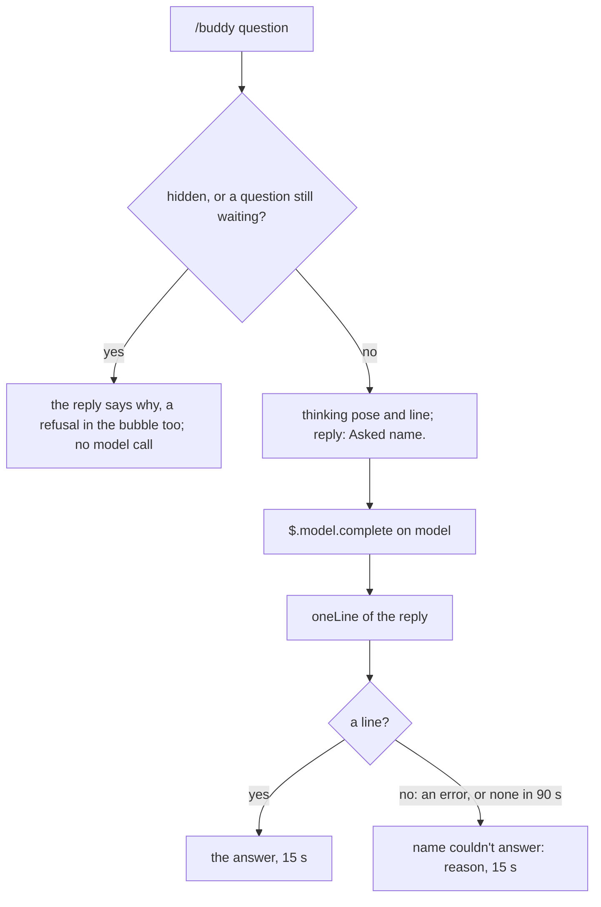

# Voice

buddy talks through a model in two ways, and a third when asked: it answers a question you ask with `/buddy`; at the end of every answered turn one call writes its reaction to the turn (`commentAfterEachTurn`) and, as its second brain, judges Claude's last move and writes your next prompt (`suggestNextPrompt`), both on by default, and edits its memory items for the chat; and with `promptWhenIdle` on, one call of its own once the chat sits idle, deciding whether to prompt Claude to resume ([Away mode](#away-mode-promptwhenidle)).
Everything else it says is a canned line ([Characters](./characters.md)), and every model reply is held to one bubble line and a few tokens.

## Questions

`/buddy` followed by anything that is not a command is a question.
Asked for a prompt ("put it in a prompt for me"), the answer adds a line `SUGGEST_NEXT_PROMPT: {prompt}` (`ASKED_PROMPT_RULE`); `parseAskReply` takes it off the answer, and `putAskedPrompt` puts it in the prompt box and in the drawer as the suggested prompt ctrl+x u uses. A turn running then leaves it in the drawer alone; one past `ASKED_PROMPT_MAX_CHARS` (600) is said in the bubble and the drawer, never put.
A command word counts only when it stands alone, so `/buddy reload the page` is a question, not `/buddy reload` (`parseCommand`).
`/buddy list` alone, or `/buddy use` with one word after it, is no question either: switching moved to the personality picker, and the reply is `Switching characters moved to the personality picker: ctrl+x t in /buddy.`, with no model call. `/buddy` alone opens the drawer, no question either.



`$.model.complete` runs on `model` at `effort`, with the persona, the character rule (`CHARACTER_RULE`: one useful thing both the user and Claude missed, the character deciding how it is said, never what is true; stated as fact only what the chat shows or what is generally true, a guess about the chat's own state, a file, a process, what someone did, asked as a question or named as the check that settles it), the memory rule (`memoryRule`: its memory reaches the last `chatTurnsToRead` turns, and anything older it says it doesn't remember, never guessing) and the one-line rule as the system prompt (`oneLineSystem`), and the buddy's memory ([chatTurnsToRead](./chatTurnsToRead.md)) and the question as the prompt (`questionPrompt`), capped at 2048 output tokens (`QUESTION_MAX_TOKENS`), thinking included.
It does not see the rest of the chat, and it answers at once, even while the main turn runs.

The command replies `Asked {name}.` at once, and the model call runs after the handler returns; the `thinking` line holds the bubble meanwhile, until the answer, the failure or the deadline arrives.
A question has 90 seconds (`COMPLETE_DEADLINE_MS`).
The answer replaces the `thinking` line for 15 seconds.
A question the model answers with no words is asked once more while at least 10 seconds of its deadline remain (`retriesEmpty`, `RETRY_MIN_MS`; the log's `ask.retry`, and `ask.outcome` counts both calls, and the first's usage whatever the retry does, a timeout or a throw included). A call that fails or answers nothing, or a question past its deadline (`no answer in 90 s`), shows `{name} couldn't answer: {reason}` with the `oops` pose, and the log names the reason (`noAnswerReason`): `api-error` carries its status (`api-error 529`), `empty-reply` and `aborted` read as themselves.
The deadline ends the question in the bubble; the completion's own `timeoutMs` (`requestTimeoutMs`: the time left before the deadline when it is sent, plus 5 seconds) makes the engine abandon the request 5 seconds past the deadline, however late it was sent. One deadline, from the question's start, covers the `chatTurnsToRead` read, the settings and the completion.
The answer belongs to the character asked: when another is drawn by the time it arrives, the answer or the failure is dropped, never said by the new one, and the log says `{name}'s answer was dropped: {drawn} is drawn now`.
One question waits at a time: one asked meanwhile is refused out loud, in the reply and the bubble (`{name} is still thinking about your last question`).
An answer, a failure or a refusal holds the bubble for its time; tool-call reactions and other unasked lines wait.

## The end-of-turn call

`commentAfterEachTurn` and `suggestNextPrompt` are on by default (`commentAfterEachTurn: true`, `suggestNextPrompt: true`); each turns off alone. `promptToMainChat` is on by default (`promptToMainChat: true`): on, the same call may write `PROMPT_TO_MAIN_CHAT:`, a prompt the buddy sends Claude itself through `$.prompt.submit`, which the buddy's own `prompt.submit` hook marks for Claude with `BUDDY_PROMPT_CONTEXT`; it brings the judgement lines with it, and `RULE_BROKEN:` after it, the key of the user's rule it is about ([Steering: the user's rules](#steering-the-users-rules)); it is armed by each prompt of the user's and disarmed by the send, so the turn it starts never sends another.
At the end of every turn (`turn.complete`), the brain resets the turn's tally and returns it with whether `commentAfterEachTurn` is due (`endTurn`): `commentAfterEachTurn` on, and at least `secondsBetweenComments` seconds (0 by default: every turn) of brain time since the last `commentAfterEachTurn`.
The call is made only for an answered turn of the main loop (`reason: 'answer'`, not aborted, no `agentId`), tool use or not, while the buddy is shown, when `commentAfterEachTurn` is due or `suggestNextPrompt` is on.
It is one `$.model.complete` on `model` at `effort`, at most 2048 output tokens, thinking included (`TURN_MAX_TOKENS`), within 30 seconds (`TURN_DEADLINE_MS`): about 3 seconds. The character's prompt and the suggestion's are one system prompt, combined as the options ask, and one reply carries every line.
A call that cannot answer (an API error, an empty reply, the deadline) fails `commentAfterEachTurn` and gives `suggestNextPrompt` up to the engine's own suggestion; a reply arriving after a later main turn ended, however it ended, or after a `/clear` or a resume, is stale (`turnGen`): nothing of it is shown, and only its `MEMORY:` edit is kept, unless a newer memory save came first or the conversation changed ([Its memory items](./chatTurnsToRead.md#its-memory-items)).
The call speaks as the character drawn when the turn ended: what arrives after a switch is dropped, never said by the new one.
`commentAfterEachTurn` is asked for only once the band has drawn in the session (`turnMay`); before that the call writes the second brain alone.
Each turn is filed under its `turnId` with the prompt that started it, as `turn.start` carries it (`startPromptTurn`, `endPromptTurn`); `prompt.submit` supplies its origin (`submitPrompt`, `isUserOrigin`), so a peer message or task notification delivered into a running turn never takes the next turn's prompt, and a turn not started by the user is filed as such. The user's own origins are the terminal, Remote Control, an SDK host, the owner's Slack ping and a follow-up to the user's own action; a turn whose submission was never seen, or that the engine could not place, is shown as sent by a sender the buddy did not see, most often the user's own slash command or skill. A submission never matches the turn it was typed over, and a prompt that started no turn is dropped at the next turn's start, never handed to a later one. The running turn's marker and its prompt clear at every main `turn.complete`, before the hooks beneath it run and whether or not a character is loaded (`onTurnEnd`). Only an answered or interrupted turn with a person at the prompt is filed into the `chatTurnsToRead` ([chatTurnsToRead](./chatTurnsToRead.md)), an interrupted one marked so, before the end-of-turn call reads it. A `/clear` or a resume (`session.end`, `endsConversation`) moves the process to another session id, and with it to another `chatTurnsToRead`; it empties the prompts, and a `/buddy` question asked before it is dropped, never shown or remembered, however its call ends, a throw included.
`parseTurnReply` reads the reply, and `commentAfterEachTurn.outcome` carries the call's usage (`usageFields`: `inTok`, `cacheRead`, `cacheWrite`, `outTok`, `cachePct`) and `ms`, from the turn's end to the reply; when the call wrote no `commentAfterEachTurn`, `verdict.outcome` carries the usage instead, and `suggestNextPrompt.outcome` carries its `ms`.
The system prompt (`turnSystem`) is the persona, the character rule, the second brain's charge when `suggestNextPrompt` is wanted, then the tagged lines wanted, the judgement first: `DESIRE:`, `VERDICT:` and `WHY:` ([The second brain](#the-second-brain-suggestnextprompt)); `COMMENT_AFTER_EACH_TURN:` the buddy's own reaction in character, at most 20 words, written knowing the verdict and never repeating `WHY` when both are wanted; and `SUGGEST_NEXT_PROMPT:`, following the verdict; then, always, one `MEMORY:` line, a JSON object keyed by the chat's memory items it adds, changes or ends, checked in code before any is kept ([Its memory items](./chatTurnsToRead.md#its-memory-items)).
The prompt is the `chatTurnsToRead` (the last `chatTurnsToRead` answered main-thread turns, 4 by default, 1 to 10, oldest first, each the prompt its `turn.start` carried, the user's or not, what Claude did, and Claude's answer, filtered as [chatTurnsToRead.md](chatTurnsToRead.md) says, with what the buddy and the user said after each, and its numbers ([The numbers](./chatTurnsToRead.md#the-numbers)); the turn just ended is the last), then a pointer to it (`turnPrompt`, `JUST_ENDED`); a memory missing that turn gets the turn's tally instead:

```text
What you remember, oldest first:

Turn 1. The user asked Claude:
suggested: none
sent: run the tests
Claude did: read package.json, vitest.config.ts, setup.ts; Run the tests
Numbers: 38s · 4 model requests · 4 tool calls (Read 3, Bash 1) · test runs 1 passed · tokens 96k in (88% cached), 1.4k out · $0.08 · context 21% full of 200k · on opus-5 at high effort
Claude answered:
All 42 pass.

The turn that just ended is the last one above.
```

`parseTurnReply` reads every tagged line in any order and case, bullets tolerated; an untagged reply is `commentAfterEachTurn` alone.

### commentAfterEachTurn

`commentAfterEachTurn` goes through `oneLine` and shows with `yay` when the turn had no failures, `oops` when it had some.
A `commentAfterEachTurn`, or its failure, that arrives while a `/buddy` answer, its failure, a refusal or the `thinking` line still holds the bubble (`holdsAnswer`) is not said and not remembered; the log records it as `held` (`commentAfterEachTurn.outcome`). The previous turn's `commentAfterEachTurn` never holds against the next one, which replaces it; a line nobody asked for waits behind either.
A call that fails, times out or has no `commentAfterEachTurn` fails it as a question fails, in the bubble.

### The second brain: suggestNextPrompt

With `suggestNextPrompt` on, the call's system prompt carries the second brain's charge (watch the work and judge it, a second pair of eyes on every decision), the desire named at the last turn's end with `Keep it unless this chat shows it changed.` when there is one, and four tagged lines, the comment written between `WHY` and the suggestion:

- `DESIRE:` what the user most deeply wants from this chat, beneath the words of this turn, in plain words, at most 15 words; kept in `desire` for the next turn's call, forgotten at `/clear` or a resume, dropped past 160 characters (`DESIRE_MAX_CHARS`).
- `VERDICT:` `RIGHT`, `SHORTCUT` or `WRONG` (`VERDICTS`), judging Claude's last move (what it did, claimed and proposes) against `DESIRE`: `RIGHT` serves it the proper way; `SHORTCUT` is the fast or easy way that costs later (a skipped check, a symptom patched, a guess where reading was possible, "done" claimed without evidence); `WRONG` works against it (the wrong problem, a destructive or irreversible step, a false claim, a drift from what was asked).
- `WHY:` the concrete reason, naming the thing, in character, at most 20 words; screamed for `WRONG`.
- `SUGGEST_NEXT_PROMPT:` the prompt the user should send next, as they would type it, at most 20 words: an ask, an instruction or a decision, every fact in it already in the chat, never a report of what the user did, ran, saw or saved, since one key sends it unread, and never an approval, a ruling or an observation put in the user's mouth (no "approved", "as I said", "I checked", "looks right"), asking for the step instead; when the next step is the user's own, what they would ask Claude about it; after `RIGHT` a yes and the next step, after `SHORTCUT` a request for the proper way, after `WRONG` a stop naming what to do instead; `NONE` only when the work is plainly finished.

A verdict not one of the three, or one without a `WHY`, is none.
The bubble says the verdict before the comment, by its tone (`VERDICT_BUBBLE`, `sayVerdict`): `RIGHT` says nothing over the comment; `SHORTCUT` puts the why in a yellow bubble (`warn`); `WRONG` in a red, bold one with the `oops` pose (`alarm`); `TONE_COLOR` inks the frame and the words, and a bubble drawn above the sprite for want of room takes the same ink. A held `/buddy` answer keeps the bubble against a verdict as against a comment. The drawer shows every verdict (`verdict` entry) with `wants: {desire}` under it; the memory files the said warning as `warned` in the turn's `endOfTurn` exchange, beside the comment and the suggestion. `verdict.outcome` logs `said`, `quiet` (`RIGHT`), `held`, `hidden`, `dropped`, `none`, `failed` or `stale`, with the verdict. A comment the verdict warned or screamed over (`loudGen`) is `outranked`: never drawn over it, still in the drawer and the memory.
The persona decides how it is said; the suggestion's words are never in character.
`SUGGEST_NEXT_PROMPT:` goes through `suggestNextPromptText`, which strips wrapping quotes and collapses whitespace; `NONE`, an empty value or one past 200 characters (`SUGGEST_NEXT_PROMPT_MAX_CHARS`) proposes nothing.
`suggestNextPrompt` becomes the prompt box's dim suggestion through `$.prompt.suggest`; a late one is safe, since Claude Code refuses it once the box holds text or a turn runs.
A `suggestNextPrompt` overtaken by a later turn's start or end, a `/clear` or `/buddy off` is stale and never proposed.
A prompt of the user's sent while the buddy's suggestion is in the box answers it (`takeSuggestion`), by how it used the suggestion, both folded (whitespace runs to one space, trimmed, lower case; `suggestionUse`):

| Use | When | Claude reads beside it (`prompt.submit`'s `context`) | The turn is filed |
| --- | --- | --- | --- |
| `unedited` | the prompt is the suggestion | `TAKEN_SUGGESTION_CONTEXT`: the prompt is the buddy's suggestion, sent unedited; whatever it says the user did or saw is the buddy's guess, to check before acting on it; never to be recorded as the user's ruling, order or approval | as `taken-suggestion`, the user's choice, the buddy's words, with `suggested` |
| `extended` | the prompt starts with the whole suggestion and goes on at a word boundary, the user's own words after it | `EXTENDED_SUGGESTION_CONTEXT`: the prompt starts with the buddy's suggestion and the user added words of their own; a claim in the suggested part is the buddy's guess; only the added words are the user's, the suggested part never their ruling, order or approval | as the user's, with `suggested` |
| none | the prompt edits the suggestion, or goes on mid-word | nothing | as the user's own, with `suggested` |

Either use logs `suggestNextPrompt.taken` with its `use`, and the drawer counts it used (`answerSuggestions`). Every user turn filed beside a suggestion keeps it as `suggested`, so the model reads the turn as `suggested: {text}` and `sent: {prompt}`, apart, and a rule's words are checked only against what the user typed beyond the suggestion (`afterSuggestion`, `typedByUser`, [chatTurnsToRead](./chatTurnsToRead.md#its-memory-items)). A peer's or a notification's prompt leaves the box's suggestion as it is; another suggestion shown replaces it.

While `suggestNextPrompt` is on and the buddy is shown, the `prompt.suggest` hook holds back Claude Code's own guess (origin `suggestion`, `dropsHarnessSuggestion`), so it never covers the buddy's; a plugin's proposal, the buddy's or another's, always passes.
When the buddy gives up on a turn (timeout, no answer, `NONE`, an error), or a turn makes no call of its own, the held guess is proposed after all, and one arriving later passes: the box is never emptier than without the plugin.
Claude Code's own suggestions still cost their own call: turning them off saves paying for both.
The log records each outcome at info (`suggestNextPrompt.outcome`: shown, not-shown, none, failed, stale; and for the engine's held suggestion harness-shown, harness-not-shown, harness-replaced when the buddy's own was shown instead, harness-hidden when the buddy was hidden, harness-stale when a later turn started or the conversation ended first: `heldSuggestionRelease`), and at debug only lengths, never the prompt or the `suggestNextPrompt`.

### Steering: the user's rules

With `promptToMainChat` on, the buddy's memory steers the main chat through the user's live rules ([Its memory items](./chatTurnsToRead.md#its-memory-items)), in [`src/steering.ts`](../../plugins/buddy/src/steering.ts).

- **The rules ride every prompt.** The `prompt.submit` hook attaches the live rules to every prompt that enters the session, the user's, a peer's or the buddy's own, after any suggestion or buddy-prompt context, for Claude alone (`userRulesContext`, `rulesContext`): `RULES_CONTEXT_HEAD`, then one line per `rule.` item in the items' order, `- "{words}" (covers {covers})`. Facts and the other kinds are never listed. No live rule, a memory not yet loaded, or the option off attaches nothing.
- **The reply names the rule.** Right after `PROMPT_TO_MAIN_CHAT:` the call asks for `RULE_BROKEN:`, the key of the rule under "Your memory" that the prompt is about, or `NONE`; `parseTurnReply` keeps it only as a well-formed `rule.` key (`ruleBroken`).
- **The ladder.** A reply that names a live rule strikes it (`climbRuleLadder`, `strikeRule`): the strikes are first pruned to the live rules, then the named one's count rises by one. The first strike sends the reply's prompt, or the rule's own when it wrote none (`rulePrompt`: `The user's rule, in their words: "{words}" (covers {covers}). This turn did not follow it.`); the second sends it again starting `Again: ` (`AGAIN_PREFIX`); the third and every later one sends nothing to Claude and warns the user in the bubble, in the `warn` tone, marking the turn loud so its comment never covers it (`warnOfRule`, `ruleWarning`: `Claude broke your rule again: "{words}"`). The warning is filed as the turn's `warned`, after a verdict's warning when both are said (` · `); a hidden buddy says none, and the strike still counts. Each strike logs `rule.strike` with its `key`, `count` and `step`. A key that names no live rule, or `NONE`, strikes nothing and leaves the reply's prompt as it is.
- **Strikes kept per chat.** The counts live in `memory.json` as `strikes`, by rule key, written only when they changed (`sameStrikes`); read back, only a rule key with a positive whole count is kept (`strikesOf`). A rule ended by a `MEMORY` op takes its strikes with it, so a rule set again starts its ladder over. A strike that cannot be saved is said like any memory write failure, and the turn's comment still shows.
- **Only a call that may prompt.** The ladder runs only when the call asked for `PROMPT_TO_MAIN_CHAT` (on, and armed by a prompt of the user's); a reply stale by `turnGen` strikes nothing.
- **A prompt the chat moved past is never sent.** When the reply arrives, after the strike is counted, the buddy's prompt is dropped when the user prompted while the call ran (`promptToMainChat.stale`), or a main turn is running or a newer turn was filed (`promptToMainChat.movedOn`) (`promptOvertaken`). The reply stale by `turnGen` drops its prompt the same way, while the conversation is the same. Either way the prompt is remembered in the turn's `endOfTurn` exchange as `unsentPrompt`, which the model reads as `wrote Claude a prompt, never sent because the chat moved on`.

## Away mode: promptWhenIdle

With `promptWhenIdle` on (off by default), a chat left idle after an answered turn gets one call of the buddy's own asking whether Claude should resume, in [`src/away.ts`](../../plugins/buddy/src/away.ts).

- **Trigger.** At every main turn's end in an interactive session the wait is cancelled and, for an answered turn with a non-blank answer, armed again: the answer kept verbatim (`lastAnswer`), and `$.clock.after` waits `AWAY_IDLE_MS`, 30 minutes (`armAway`). An interrupted, errored or refused turn, or one with no answer, arms none, logged `away.skipped` with why: the user stopped it, or the API did. Any prompt, whoever sent it, a turn's start, a `/clear` or a resume cancels the wait (`disarmAway`). When the wait ends, the call is skipped, logged `away.skipped`, when the chat moved on (another turn ended, or the conversation changed), a turn is running, `AWAY_PUSHES_MAX` pushes were sent without a prompt of the user's, no character is drawn, or the buddy is off (`awaySkip`). So each idle stretch makes at most one call.
- **Its own protocol.** The call inherits nothing from the end-of-turn call: one completion of kind `away` on `AWAY_MODEL` (`opus`) at `AWAY_EFFORT` (`low`), never the `model` and `effort` options; `AWAY_SYSTEM`, R4b's prompt d2 verbatim, never the persona, the memory, the timeline, the user's prompt or a comment tag; the body is Claude's last response, whole (`awayBody`: `Claude has been idle for 30 minutes. Its last response, verbatim:` inside `<last_response>`); at most 256 output tokens (`AWAY_MAX_TOKENS`) within 30 seconds (`TURN_DEADLINE_MS`). The round file saves it as an `away` call.
- **Grammar.** `awayDecision` reads the reply trimmed whole: exactly `PAUSE` pauses; one line `PUSH: {text}` with a non-blank text pushes it; anything else is `malformed` and acts as a pause.
- **The forbidden check.** A push whose text asks a git push, a push to a branch or remote, a deletion (`rm`, delete, remove, drop, wipe, `reset --hard`), a publication, release, tag or merge, or a credential, token, login, account, API key, password or secret step (`AWAY_FORBIDDEN`, R4b's pattern without `g`, so it holds no state between calls) is `refused` and sends nothing: a false push costs more than a missed one.
- **The push.** A reply that lands after the chat moved on (another turn, a prompt of the user's, a running turn, another conversation) sends nothing, logged `away.stale`. Otherwise a push is sent as the buddy's own prompt (`sendPromptToMainChat`): `BUDDY_PROMPT_CONTEXT` beside it for Claude, its words yellow in the bubble, `promptToMainChat.sent` logged, and the turn it starts filed as the buddy's. That turn's end arms the next wait, so the pushes chain; `AWAY_PUSHES_MAX`, 3, bounds them until the user prompts again, which resets the count (`awayPushes`).
- **Every decision logged.** `away.decision` records `pause`, `push`, `malformed`, `refused` or `unanswered` (with why), the call's `ms`, and a push's length, never its text, so its real recall can be measured later.
- **Risk.** It shipped without the gating experiment, by the owner's ruling, and the shipped prompt was not re-measured: on R4b's cases it never woke a chat wrongly but missed most chats that should have resumed.

## One line, few tokens

Every model reply must fit one bubble.
Three layers hold it there:

| Layer | What it does | Where |
| --- | --- | --- |
| The one-line rule | `Answer in ONE line, at most 25 words, in character. Do not use tools. Do not think out loud.`, in every question's system prompt | `ONE_LINE_RULE` |
| A token cap | 2048 output tokens for a question and for the end-of-turn call: the model's thinking counts against it, so a tight cap cut answers short or left none; the rules keep the text to one line | `QUESTION_MAX_TOKENS`, `TURN_MAX_TOKENS` |
| The trim | the first non-empty line, quotes and backticks stripped, never cut: what the buddy says to you is kept whole, in the bubble, the memory and the drawer | `oneLine` |

The rule exists because a model's reply, without it, spent 813 output tokens on what should have been one line.
Each clause closes one way a working chat's model spends tokens: length, tools, thinking out loud.
The rule makes the model aim for one line; the cap and the trim catch the rest.

## `model` and `effort`

`model` (default `opus`) is an alias such as `opus`, `sonnet` or `haiku`, or a full model id; `effort` (default `low`; low, medium, high, xhigh or max) is how hard it thinks on each call, passed to every `$.model.complete` the buddy makes.
Either can be `inherit`, resolved before every call by `callSettings`: `model: inherit` is the main chat's model (`$.session.model()`, `resolveModel`), `opus` when it cannot be read; `effort: inherit` is the effort of the main chat's latest model request, which the `turn.step` hook records for every main-loop step (`observeEffort`; a subagent's step leaves it) and passes through untouched; a level is sent as it is, and a number, a request without effort, or no request yet sends none (`resolveEffort`), so the model's default applies. A failed model read is logged once and falls back; each call's resolved model and effort are logged at debug (`turn.settings`, `ask.settings`), and `session.start` logs the options as set, `inherit` included.
It serves both calls: the end-of-turn call and every question. The away call keeps its own, opus at low effort ([Away mode](#away-mode-promptwhenidle)).
A question it answers carries the `chatTurnsToRead` before the question, since a completion cannot see the chat.
Like every option, it is resolved once at load by `resolveOptions`: a value of the wrong type is ignored by name (`option model ignored: not a string`), logged at session start, said once in the first greeting's bubble, and listed under `/buddy help`.

## Decisions

- **A question answered by `model` on the last turns.** Rejected: a completion blind to the chat, which answers nothing useful about the work. The chat's last `chatTurnsToRead` turns tell it where the chat stands, and it answers in about 3 seconds, even mid-turn.
- **A 90-second safety net.** Rejected: no deadline. The deadline guarantees the bubble ends; the request's `timeoutMs`, just past it, abandons the call, so one timer decides the reason.
- **The rule in the prompt, and a cap, and a trim.** Rejected: a token cap alone, which cuts a rambling answer mid-sentence. The rule shapes the answer; the cap bounds the cost; the trim guarantees one line.
- **Reply at once, answer later.** Rejected: holding the command until the model answers. The prompt stays free, and the bubble shows the buddy thinking.
- **One call per turn, the character's prompt and the suggestion's combined.** Rejected: a separate call for the second brain beside the comment's, built and withdrawn before release: twice the calls for what one reply carries, and the comment and the verdict could no longer see each other. One system prompt holds the persona, the character rule and the second brain, each part only when its option asks for it; one reply carries every line, the judgement first so the comment is written knowing it. And a buddy that spoke only after tool use, past `secondsBetweenComments`, spoke too little.
- **The desire carried from turn to turn.** Rejected: naming it afresh each turn, which drifts with every small step. The last one is handed back, kept unless the chat shows it changed.
- **A warning outranks the comment in the bubble.** Rejected: the comment first, which buries the one line that must not be missed. The drawer and the memory keep both.
- **Every call sees the ends of the last `chatTurnsToRead` turns, not the whole chat.** Rejected: a summary alone, which cannot tell what the user will ask next; and replaying the main chat's whole request, which sees everything but in a long session answers after about a minute, cannot be cancelled, takes no token cap, and mid-turn would only continue the main turn. A companion's aside has to be fast, so both calls run on `model`, with no option to choose another path.
- **`suggestNextPrompt` in the user's words.** Rejected: a `suggestNextPrompt` in character, which would have to be rewritten before sending, which defeats Tab.
- **A suggestion asks, instructs or decides; it never reports.** Rejected: the prompt the user is most likely to send next, in the user's own words. After a turn that hands the user a step, the likeliest next message is the report of that step done, so the model wrote it, results included, and one key sent it to Claude as the user's testimony. Replayed on the rounds that did it, the rule took fabricated reports from 9 in 36 replies to none in 48.
- **A suggestion taken unedited says so to Claude.** Rejected: a word filter dropping suggestions that read like reports. On the same replays it caught no report the rule left and dropped good suggestions ("I'll tell you when the token is saved"); the note beside a taken suggestion protects Claude whatever the suggestion says.
- **A suggestion kept whole at the prompt's start is extended, by a prefix match at a word boundary.** Rejected: any prompt that differs from the suggestion counting as the user's own. Prompts that extended a suggestion then reached Claude with no note, and a rule's words could be drawn from the buddy's own suggestion; now the turn files `suggested`, and only the words after it count as typed by the user. Going on mid-word is an edit, never an extension.
- **Two contexts, one per use.** Rejected: the unedited note for an extended prompt too, which would call the user's own added words the buddy's. The extended note names the suggested part as the buddy's guess and the added words as the user's.
- **Suggested and sent shown apart.** Rejected: a label on a taken turn alone. Every user turn reads `suggested:` (or `none`) then `sent:`, so the model sees what the buddy put in the box beside what the user chose to send, for every use.
- **A suggestion never speaks for the user.** Rejected: guarding only its claims. A suggestion sent with one key could carry "approved" or "as I said" into the chat as the user's ruling; the suggestion asks for the step instead, and both notes tell Claude never to record the suggested words as the user's ruling, order or approval.
- **The user's rules ride every prompt.** Rejected: leaving them to the buddy's own prompt after a lapse, which reaches Claude only once a rule is already broken, and only when the buddy notices. The rules, quoted in the user's words, come with every prompt while `promptToMainChat` is on.
- **A ladder, then the user.** Rejected: sending the same correction every time a rule is broken, which nags Claude without effect. The first strike prompts, the second says it again, and from the third the buddy stops prompting and tells the user, who can act on it. A strike counts when the buddy names the rule, even when its prompt is then dropped as stale; the counts live per chat in `memory.json` and vanish when the rule ends.
- **A prompt the chat moved past is remembered unsent.** Rejected: sending it once a peer's turn or a running turn had moved the chat past it, which answered a turn already gone; and dropping it with a log line alone, which left the buddy no trace of what it wrote. The exchange keeps it as `unsentPrompt`, so the next call knows it was written and never sent.
- **Away mode ships ungated.** By the owner's ruling, without the gating experiment: prompt d2, body A, opus at low effort. Every decision is logged as `away.decision` so its real recall can be measured.
- **The away call keeps its own model and effort.** Rejected: the `model` and `effort` options. R4b measured only opus at low effort, and Haiku answered outside the grammar.
- **The away body is Claude's last response alone.** Rejected: adding the user's standing orders, such as a sign-off granting autonomy, which could wake the chat by accident; the call decides on what Claude itself left owed.
- **A forbidden push is refused in code.** Rejected: trusting the prompt's own "never ask for a git push" alone. A false push costs more than a missed one, so a push matching the forbidden pattern acts as a pause.
- **At most 3 pushes in a row.** Rejected: no cap, which lets a misjudging protocol keep a chat running all night; a prompt of the user's resets it.
- **A cut turn arms no away call.** An interrupted, errored or refused turn was stopped by the user or the API; waking it would overrule that.
- **The option is `promptWhenIdle`.** Rejected: a name with "push", which the README and the repo's rules use for git. It follows `promptToMainChat`: what the buddy sends, plus when.
- **A failure shows in the bubble.** Rejected: staying silent. An empty bubble would read as "it did not hear me".
- **Command words only when alone.** Rejected: matching the first word. `/buddy reload the page` is a question.

## Where it lives

| File | Symbols |
| --- | --- |
| [`src/prompts.ts`](../../plugins/buddy/src/prompts.ts) | `ONE_LINE_RULE`, `QUESTION_MAX_TOKENS`, `TURN_MAX_TOKENS`, `TURN_DEADLINE_MS`, `oneLineSystem`, `memoryRule`, `questionPrompt`, `CHARACTER_RULE`, `turnSystem`, `TurnReply`, `MEMORY_LINE`, `VERDICTS`, `Verdict`, `DESIRE_MAX_CHARS`, `turnPrompt`, `parseTurnReply`, `oneLine`, `lostThread`, `stillThinking`, `TurnSummary`, `suggestNextPromptText`, `TAKEN_SUGGESTION_CONTEXT`, `EXTENDED_SUGGESTION_CONTEXT`, `BUDDY_PROMPT_CONTEXT`, `SUGGEST_NEXT_PROMPT_MAX_CHARS`, `turnMay`, `skipReason`, `submitPrompt`, `endPromptTurn`, `endsConversation`, `requestTimeoutMs`, `isUserOrigin`, `startPromptTurn`, `retriesEmpty`, `RETRY_MIN_MS` |
| [`src/suggestNextPrompt.ts`](../../plugins/buddy/src/suggestNextPrompt.ts) | `dropsHarnessSuggestion`, `suggestNextPromptOutcome`, `heldSuggestionRelease`, `SuggestionUse`, `suggestionUse`, `afterSuggestion` |
| [`src/steering.ts`](../../plugins/buddy/src/steering.ts) | `Strikes`, `StrikeStep`, `RULES_CONTEXT_HEAD`, `AGAIN_PREFIX`, `rulesContext`, `strikeRule`, `strikesOf`, `rulePrompt`, `ruleWarning`, `sameStrikes` |
| [`src/away.ts`](../../plugins/buddy/src/away.ts) | `AWAY_IDLE_MS`, `AWAY_MODEL`, `AWAY_EFFORT`, `AWAY_MAX_TOKENS`, `AWAY_PUSHES_MAX`, `AWAY_SYSTEM`, `AWAY_FORBIDDEN`, `AwayDecision`, `awayBody`, `awayDecision` |
| [`src/feed.ts`](../../plugins/buddy/src/feed.ts) | `answerSuggestions` |
| [`src/log.ts`](../../plugins/buddy/src/log.ts) | `usageFields`, `sumUsage`, `notice` |
| [`src/deadline.ts`](../../plugins/buddy/src/deadline.ts) | `within` |
| [`src/scene.ts`](../../plugins/buddy/src/scene.ts) | `Tone`, `TONE_COLOR` |
| [`src/brain.ts`](../../plugins/buddy/src/brain.ts) | `beginQuestion`, `endQuestion`, `answer`, `failAnswer`, `refuseQuestion`, `holdsAnswer`, `endTurn`, `react`, `COMPLETE_DEADLINE_MS`, `deadlineReason`, `noAnswerReason` |
| [`src/command.ts`](../../plugins/buddy/src/command.ts) | `parseCommand`, `USAGE` |
| [`src/options.ts`](../../plugins/buddy/src/options.ts) | `resolveOptions`, `DEFAULTS`, `resolveModel`, `resolveEffort`, `observeEffort`, `INHERIT` |
| [`hooks/buddy.tsx`](../../plugins/buddy/hooks/buddy.tsx) | `ask`, `callSettings`, `onTurnStep`, `onTurnEnd`, `onTurnComplete`, `turnCall`, `sayVerdict`, `VERDICT_BUBBLE`, `sayCommentAfterEachTurn`, `showSuggestNextPrompt`, `giveUpSuggestNextPrompt`, `runCommand`, `forgetConversation`, `takeSuggestion`, `onPromptSubmit`, `onTurnStart`, `userRulesContext`, `climbRuleLadder`, `warnOfRule`, `promptOvertaken`, `sendPromptToMainChat`, `armAway`, `disarmAway`, `awaySkip`, `awayCall`, the `prompt.submit`, `turn.start` and `prompt.suggest` hooks |
| [`plugin.json`](../../plugins/buddy/.claude-plugin/plugin.json) | `userConfig`: `chatTurnsToRead`, `commentAfterEachTurn`, `model`, `effort`, `secondsBetweenComments`, `suggestNextPrompt`, `promptToMainChat`, `promptWhenIdle` |

## How it's tested

- Unit: [`tests/prompts.test.ts`](../../tests/prompts.test.ts) (the completion and where the `chatTurnsToRead` goes, the memory rule, the character rule, the end-of-turn system as the options combine it, prompt and reply, the trim), [`tests/scene.test.ts`](../../tests/scene.test.ts) (a loud bubble's tone), [`tests/command.test.ts`](../../tests/command.test.ts), [`tests/options.test.ts`](../../tests/options.test.ts), the end-of-turn and question cases of [`tests/brain.test.ts`](../../tests/brain.test.ts) (the summary at every end, `commentAfterEachTurn` due when on and past `secondsBetweenComments`, the question deadline and failure reasons), [`tests/suggestNextPrompt.test.ts`](../../tests/suggestNextPrompt.test.ts) (which suggestion is dropped; a prompt's use of the suggestion, unedited, extended or neither, and the words added after it), [`tests/steering.test.ts`](../../tests/steering.test.ts) (the rules context, the ladder's steps and pruning, strikes as `memory.json` holds them, the ladder's words), [`tests/away.test.ts`](../../tests/away.test.ts) (the away call's constants and system prompt, the body quoted whole, the `PAUSE`/`PUSH:` grammar and the forbidden check, call after call).
- Hooks, steering (`promptToMainChat` on): the live rules ride the user's, a peer's and the buddy's own prompts, none before the memory loads, none when off; a rule broken again is sent, sent again, then warned of in the bubble, each strike logged and kept; with no prompt of the buddy's the rule's own is sent; a rule ended by a `MEMORY` op loses its strikes; a prompt the chat moved past (a peer's turn, a running turn, the user prompting) is never sent and remembered unsent; a strike that cannot be saved is said.
- Hooks, away mode (`promptWhenIdle`): off makes no call; on, 30 idle minutes make one call on opus low with its own system and the answer verbatim, once per stretch; a push reaches Claude as the buddy's own prompt; a malformed or refused reply sends nothing; a prompt within the 30 minutes, a `/clear`, or a cut last turn arms or makes none; a prompt during the call makes it stale; the fourth push in a row is not asked for until the user prompts; the call is saved as `away` in the round file; a throw is logged and the band stays drawn.
- Hooks, a taken suggestion: unedited, extended, edited, and a peer's prompt over it, each with what Claude reads and how the turn is filed.
- Hooks, the end-of-turn call (on by default): one answered turn makes one completion, the judgement, the comment and the suggestion asked for in that order, its `commentAfterEachTurn` in the band and its `suggestNextPrompt` proposed as a plugin's; `WRONG` screamed red over the comment, `SHORTCUT` warned yellow, `RIGHT` quiet, each remembered with the comment and the suggestion; the desire carried to the next call and forgotten at `/clear`; Claude Code's own is held during the call and shown on `SUGGEST_NEXT_PROMPT: NONE`; an aborted or subagent turn makes no call; a held `/buddy` answer keeps the bubble while `suggestNextPrompt` still goes out.
- Hooks, questions: a question is one completion on `model` at `effort` with the persona, the rules and the last 4 turns, whether the main turn is idle or running (the band working, or a tool ran); an `api-error` says its status, an `empty-reply` itself; past 90 s the bubble says `no answer in 90 s` and the next question is taken.
- Live: row (d) asks before the first reply, row (f) after one, row (k) mid-turn (answered before the turn ends); row (l) finds the answered outcome in the log.
- The end-of-turn call is not checked by the live proof; the unit and hook tests are its proof.
