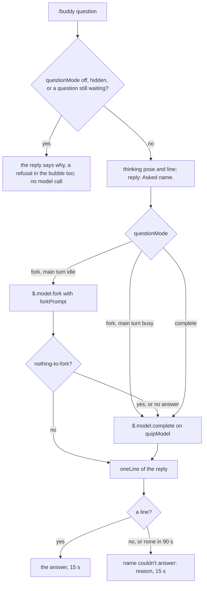

# Voice

buddy talks through a model in exactly two ways: it answers a question you ask with `/buddy`, and, when you turn quips on, it reacts to a finished turn.
Everything else it says is a canned line ([Characters](./characters.md)), and every model reply is held to one bubble line and a few tokens.

## Questions

`/buddy` followed by anything that is not a command is a question.
A command word counts only when it stands alone, so `/buddy reload the page` is a question, not `/buddy reload` (`parseCommand`).
`/buddy list` alone, or `/buddy use` with one word after it, is no question either: switching moved to the menu, and the reply is `Switching characters moved to /buddy-personality.`, with no model call.

The `questionMode` option picks the path: `fork` (the default), `complete`, or `off`.



- **Fork.** `$.model.fork` replays the main chat's own request with one more user message: the persona, the buddy's recent exchanges ([Memory](./memory.md)), `The user asks you directly: {question}.`, and the one-line rule (`forkPrompt`). It runs on the chat's model, sees the whole conversation, and reads that conversation from the chat's prompt cache instead of writing it again: the probe measured 35,814 tokens read from cache and none written. So the buddy can answer "what did we just run?".
- **While the main turn runs.** A fork replays the main thread's last request, so mid-turn it continues that turn and answers with the main chat's own words. While the band shows the chat working, or a tool ran since the last turn ended, the question goes to the quip model, as in `complete` mode; the log records the fallback and why. A fork that answers nothing falls back the same way.
- **Before the first reply.** A new session has no request to replay, and the fork answers `nothing-to-fork`. The question then goes to the quip model alone, as in `complete` mode.
- **Complete.** `$.model.complete` on `quipModel`, with the persona and the one-line rule as the system prompt (`oneLineSystem`) and the buddy's recent exchanges ([Memory](./memory.md)) plus the question as the prompt (`questionPrompt`), capped at 100 output tokens (`QUESTION_MAX_TOKENS`). It does not see the chat.
- **Off.** No model call; the reply says `questions are off (questionMode)`.

The command replies `Asked {name}.` at once, and the model call runs after the handler returns; the `thinking` line holds the bubble meanwhile, until the answer, the failure or the deadline arrives.
A question has one 90-second deadline, the fork and its fallback together: a fallback gets only the time left.
The answer replaces the `thinking` line for 15 seconds.
A call that fails or answers nothing, or a question past its deadline (`no answer in 90 s`), shows `{name} couldn't answer: {reason}` with the `oops` pose, and the log names the reason.
The deadline ends the question in the bubble, not the call: the engine offers no way to cancel a fork, so one already sent runs to its end and may still bill.
The answer belongs to the character asked: when another is drawn by the time it arrives, the answer or the failure is dropped, never said by the new one, and the log says `{name}'s answer was dropped: {drawn} is drawn now`.
One question waits at a time: one asked meanwhile is refused out loud, in the reply and the bubble (`{name} is still thinking about your last question`).
An answer, a failure or a refusal holds the bubble for its time; tool-call reactions and other unasked lines wait.

## Quips

Quips are off by default (`quips: false`), because they spend tokens on every eligible turn.
With them on, the end of each turn (`turn.complete`) asks the brain whether one is due (`endTurn`):

- the turn used at least one tool; a turn that only talked has nothing to react to;
- at least `quipCooldownSec` seconds (45 by default) of brain time have passed since the last quip;
- the buddy is not hidden.

The turn's tally resets either way.
A due quip is one `$.model.complete` on `quipModel`, at most 60 output tokens (`QUIP_MAX_TOKENS`), with the persona and the one-line rule as the system prompt.
The prompt is a summary of the turn, never its content (`quipPrompt`):

```text
The turn just ended. Tools used: Read x3, Bash. Failures: 1. Last shell command: npm test. React to it.
```

The tools are counted by name, the failures are the denied or failed calls, and the last Bash command is cut to 120 characters.
The answer shows with `yay` when the turn had no failures, `oops` when it had some.

## One line, few tokens

Every model reply must fit one bubble.
Three layers hold it there:

| Layer | What it does | Where |
| --- | --- | --- |
| The one-line rule | `Answer in ONE line, at most 25 words, in character. Do not use tools. Do not think out loud.`, in the fork's user message and in every completion's system prompt | `ONE_LINE_RULE` |
| A token cap | 100 output tokens for a completed question, 60 for a quip; `$.model.fork` takes no cap, so buddy passes it only its prompt and there the rule is the brake | `QUESTION_MAX_TOKENS`, `QUIP_MAX_TOKENS` |
| The trim | the first non-empty line, quotes and backticks stripped, cut to 240 characters with `...` | `oneLine` |

The rule exists because the probe's fork, without it, spent 813 output tokens on what should have been one line.
Each clause closes one way a working chat's model spends tokens: length, tools, thinking out loud.
The rule makes the model aim for one line; the cap and the trim catch the rest.

## The quip model

`quipModel` (default `haiku`) is an alias such as `haiku` or `sonnet`, or a full model id.
It serves three calls: quips, questions in `complete` mode, and a fork's fallback: before the first reply, while the main turn runs, or when the fork answers nothing.
The fork itself always runs on the chat's model.
Like every option, it is resolved once at load by `resolveOptions`: a value of the wrong type is ignored by name (`option quipModel ignored: not a string`), logged at session start, said once in the first greeting's bubble, and listed under `/buddy help`.

## Decisions

- **Fork by default.** Rejected: always a plain completion. A completion is blind to the chat, and a buddy that cannot see the work answers nothing useful about it; the fork's context comes from the cache, so it is cheap to read.
- **Fall back on `nothing-to-fork`.** Rejected: an error until the first reply. A new session's first question still gets an answer.
- **The rule in the prompt, and a cap, and a trim.** Rejected: a token cap alone, which cuts a rambling answer mid-sentence. The rule shapes the answer; the cap bounds the cost; the trim guarantees one line.
- **Reply at once, answer later.** Rejected: holding the command until the model answers. The prompt stays free, and the bubble shows the buddy thinking.
- **Quips off by default, only after tool use, with a cooldown.** Rejected: a quip after every turn. It would spend tokens on every message and repeat itself.
- **The quip sees a summary, not the turn.** Rejected: sending the turn's output. A tally and one command are enough to react to, and cost a few dozen tokens.
- **A failure shows in the bubble.** Rejected: staying silent. An empty bubble would read as "it did not hear me".
- **Command words only when alone.** Rejected: matching the first word. `/buddy reload the page` is a question.

## Where it lives

| File | Symbols |
| --- | --- |
| [`src/prompts.ts`](../../plugins/buddy/src/prompts.ts) | `ONE_LINE_RULE`, `QUESTION_MAX_TOKENS`, `QUIP_MAX_TOKENS`, `forkPrompt`, `oneLineSystem`, `questionPrompt`, `quipPrompt`, `oneLine`, `lostThread`, `stillThinking`, `TurnSummary` |
| [`src/brain.ts`](../../plugins/buddy/src/brain.ts) | `beginQuestion`, `endQuestion`, `askLeft`, `answer`, `failAnswer`, `refuseQuestion`, `endTurn`, `react`, `ASK_DEADLINE_MS`, `ASK_DEADLINE_REASON` |
| [`src/command.ts`](../../plugins/buddy/src/command.ts) | `parseCommand`, `USAGE` |
| [`src/options.ts`](../../plugins/buddy/src/options.ts) | `resolveOptions`, `DEFAULTS`, `QUESTION_MODES` |
| [`hooks/buddy.tsx`](../../plugins/buddy/hooks/buddy.tsx) | `ask`, `quip`, `runCommand`, `onTurnComplete` |
| [`plugin.json`](../../plugins/buddy/.claude-plugin/plugin.json) | `userConfig`: `questionMode`, `quips`, `quipModel`, `quipCooldownSec` |

## How it's tested

- Unit: [`tests/prompts.test.ts`](../../tests/prompts.test.ts) (the fork prompt, the completion, the quip summary, the trim), [`tests/command.test.ts`](../../tests/command.test.ts), [`tests/options.test.ts`](../../tests/options.test.ts), and the quips case of [`tests/brain.test.ts`](../../tests/brain.test.ts) (only with the option, a tool used, and past the cooldown).
- Hooks: a question forks the chat with the persona and the rule; `nothing-to-fork` falls back to the quip model; a failed answer says the thread was lost.
- Live: row (d) asks before the first reply (the quip model answers); row (f) asks after one (a real fork of a Haiku chat).
- Quips are not in the live proof, which runs with `quips: false`; the unit test is their only proof.
