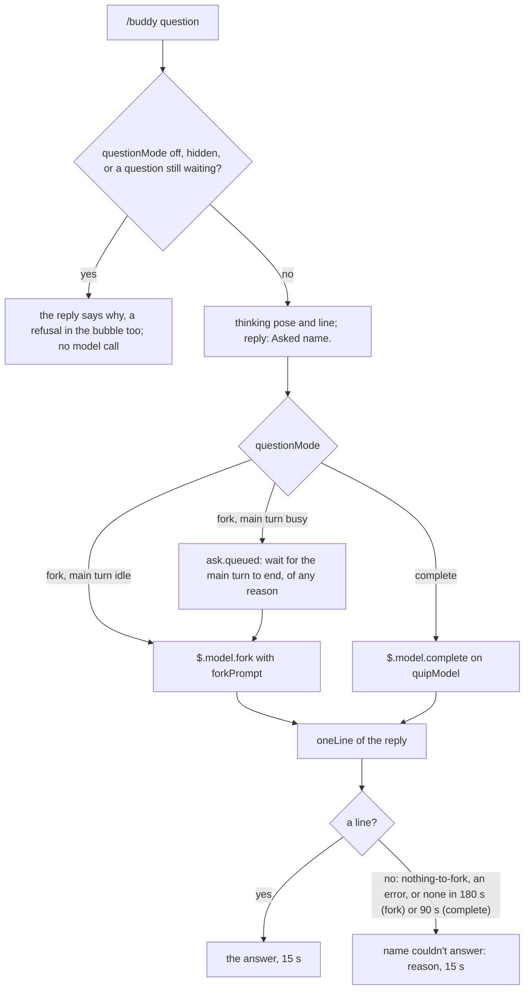

# Voice

buddy talks through a model in exactly two ways: it answers a question you ask with `/buddy`; and at the end of every answered turn one call writes its reaction to the turn (quips) and your next prompt (suggestions), both on by default.
Everything else it says is a canned line ([Characters](./characters.md)), and every model reply is held to one bubble line and a few tokens.

## Questions

`/buddy` followed by anything that is not a command is a question.
A command word counts only when it stands alone, so `/buddy reload the page` is a question, not `/buddy reload` (`parseCommand`).
`/buddy list` alone, or `/buddy use` with one word after it, is no question either: switching moved to the menu, and the reply is `Switching characters moved to /buddy-personality.`, with no model call.

The `questionMode` option picks the path: `complete` (the default), `fork`, or `off`.



- **Fork.** `$.model.fork` replays the main chat's own request with one more user message: the step out of the assistant's voice (`FORK_ROLE`), the persona, the character rule (`CHARACTER_RULE`), the buddy's recent exchanges ([Memory](./memory.md)), `The user asks you directly: {question}.`, and the one-line rule (`forkPrompt`). It runs on the chat's model, sees the whole conversation, and reads that conversation from the chat's prompt cache instead of writing it again: the probe measured 35,814 tokens read from cache and none written. So the buddy can answer "what did we just run?".
- **While the main turn runs.** A fork replays the main thread's last request, so mid-turn it would continue that turn and answer with the main chat's own words. While the band shows the chat working, or a tool ran since the last turn ended, the question waits, the `thinking` line up and the log saying `ask.queued`, until the main thread's next `turn.complete` of any reason (answered, aborted, an error; never a subagent's), then forks. Whether the main turn runs is decided once, at `ask.start`, since the band draws the question's own command as work.
- **Before the first reply.** A new session has no request to replay, and the fork answers `nothing-to-fork`. The bubble says `{name} couldn't answer: nothing to fork yet: ask again after Claude's first reply`.
- **Only the fork answers.** In `fork` mode the quip model never stands in: a fork that fails, answers nothing or runs past its deadline says so in the bubble.
- **Complete.** `$.model.complete` on `quipModel` at `effort`, with the persona, the character rule and the one-line rule as the system prompt (`oneLineSystem`) and the buddy's recent exchanges ([Memory](./memory.md)), the chat's last `contextTurns` turns (`recentTurns`) and the question as the prompt (`questionPrompt`), capped at 100 output tokens (`QUESTION_MAX_TOKENS`). It does not see the rest of the chat, and it answers at once, even mid-turn: only a fork waits.
- **Off.** No model call; the reply says `questions are off (questionMode)`.

The command replies `Asked {name}.` at once, and the model call runs after the handler returns; the `thinking` line holds the bubble meanwhile, until the answer, the failure or the deadline arrives.
A fork has a 180-second deadline (`FORK_DEADLINE_MS`), counted from when it starts, never while it waits for the main turn: in a long chat a fork runs past a minute and still answers. A `complete`-mode question has 90 seconds (`COMPLETE_DEADLINE_MS`).
The answer replaces the `thinking` line for 15 seconds.
A call that fails or answers nothing, or a question past its deadline (`no answer in 180 s` for a fork, `no answer in 90 s` in `complete` mode), shows `{name} couldn't answer: {reason}` with the `oops` pose, and the log names the reason (`noAnswerReason`): `nothing-to-fork` reads `nothing to fork yet: ask again after Claude's first reply`, `api-error` carries its status (`api-error 529`), `empty-reply` and `aborted` read as themselves.
The deadline ends the question in the bubble, not the call: the engine offers no way to cancel a fork, so one already sent runs to its end and may still bill.
The answer belongs to the character asked: when another is drawn by the time it arrives, the answer or the failure is dropped, never said by the new one, and the log says `{name}'s answer was dropped: {drawn} is drawn now`.
One question waits at a time: one asked meanwhile is refused out loud, in the reply and the bubble (`{name} is still thinking about your last question`).
An answer, a failure or a refusal holds the bubble for its time; tool-call reactions and other unasked lines wait.

## The end-of-turn call

Quips and suggestions are on by default (`quips: true`, `suggestions: true`); each turns off alone.
At the end of every turn (`turn.complete`), the brain resets the turn's tally and returns it with whether the line is due (`endTurn`): quips on, and at least `quipCooldownSec` seconds (0 by default: every turn) of brain time since the last line.
The call is made only for an answered turn of the main loop (`reason: 'answer'`, not aborted, no `agentId`), tool use or not, while the buddy is shown, when the line is due or suggestions are on.
The `turnMode` option picks how it runs, `complete` (the default) or `fork`; `turn.call` logs the mode.
In `complete` mode it is one `$.model.complete` on `quipModel` at `effort`, at most 120 output tokens (`TURN_MAX_TOKENS`), within 30 seconds (`TURN_DEADLINE_MS`): about 3 seconds.
In `fork` mode it is one `$.model.fork` of the main chat, on the chat's own model, effort and prompt cache, within `FORK_DEADLINE_MS`: it sees the whole chat, and in a long session takes about a minute. Its one message is `FORK_ROLE`, then what `turnSystem` gives a completion, then the memory (`turnForkPrompt`); no recent turns and no tally, since the fork sees the chat itself. The turn that just ended leaves the main thread free to fork. A fork that cannot answer (nothing to fork yet, an API error, an empty reply, the deadline) fails the line as a failed completion does and gives the suggestion up to the engine's own; a suggestion arriving after the next turn asked for its own is stale (`suggestGen`) and never shown.
Either way `parseTurnReply` reads the reply, and `quip.outcome` carries the call's usage (`usageFields`: `inTok`, `cacheRead`, `cacheWrite`, `outTok`, `cachePct`).
The system prompt is the persona, the character rule when a `LINE:` is wanted, then the tagged lines wanted (`turnSystem`): `LINE:` the buddy's own reaction in character, at most 20 words; `NEXT:` the prompt the user is most likely to send Claude next, in the user's own words, at most 15 words, `NEXT: NONE` only when the work is plainly finished.
The prompt is the memory, the chat's recent turns (`recentTurns`: the last `contextTurns` answered main-thread turns, `TURN_WINDOW` = 3 by default, 1 to `TURN_WINDOW_MAX` = 10, oldest first, each the end of the user's prompt from `prompt.submit`, capped at 1500 characters, and the end of Claude's answer, capped at 3000), then the turn's tally (`turnPrompt`):

```text
The main chat's last turn, oldest first:

The user asked Claude:
run the tests

Claude answered:
All 42 pass.

Tools used: Read x3, Bash. Failures: 1. Last shell command: npm test.
```

`parseTurnReply` reads the `LINE:` and `NEXT:` lines in any case, bullets tolerated; an untagged reply is the line alone.

### The line

The line goes through `oneLine` and shows with `yay` when the turn had no failures, `oops` when it had some.
A line, or its failure, that arrives while a `/buddy` answer, a failure or the `thinking` line still holds the bubble (`holdsAnswer`) is not said and not remembered; the log records it as `held` (`quip.outcome`).
A call that fails, times out or has no line fails the line as a question fails, in the bubble.

### The suggestion

The persona decides what to nudge toward; the words are never in character.
`NEXT:` goes through `suggestionText`, which strips wrapping quotes and collapses whitespace; `NONE`, an empty value or one past 160 characters (`SUGGESTION_MAX_CHARS`) proposes nothing.
The suggestion becomes the prompt box's dim suggestion through `$.prompt.suggest`; a late one is safe, since Claude Code refuses it once the box holds text or a turn runs.
A suggestion overtaken by the next turn's, or by `/buddy off`, is stale and never proposed.
While suggestions are on and the buddy is shown, the `prompt.suggest` hook holds back Claude Code's own guess (origin `suggestion`, `dropsHarnessSuggestion`), so it never covers the buddy's; a plugin's proposal, the buddy's or another's, always passes.
When the buddy gives up on a turn (timeout, no answer, `NONE`, an error), the held guess is proposed after all, and one arriving later passes: the box is never emptier than without the plugin.
Claude Code's own suggestions still cost their own call: turning them off saves paying for both.
The log records each outcome at info (`suggest.outcome`: shown, not-shown, none, failed, stale, harness-shown, harness-not-shown), and at debug only lengths, never the prompt or the suggestion.

## One line, few tokens

Every model reply must fit one bubble.
Three layers hold it there:

| Layer | What it does | Where |
| --- | --- | --- |
| The one-line rule | `Answer in ONE line, at most 25 words, in character. Do not use tools. Do not think out loud.`, in the fork's user message and in every completion's system prompt | `ONE_LINE_RULE` |
| A token cap | 100 output tokens for a completed question, 120 for the end-of-turn call's two lines; `$.model.fork` takes no cap, so buddy passes it only its prompt and there the rule is the brake | `QUESTION_MAX_TOKENS`, `TURN_MAX_TOKENS` |
| The trim | the first non-empty line, quotes and backticks stripped, cut to 240 characters with `...` | `oneLine` |

The rule exists because the probe's fork, without it, spent 813 output tokens on what should have been one line.
Each clause closes one way a working chat's model spends tokens: length, tools, thinking out loud.
The rule makes the model aim for one line; the cap and the trim catch the rest.

## The quip model

`quipModel` (default `opus`) is an alias such as `opus`, `sonnet` or `haiku`, or a full model id; `effort` (default `low`; low, medium, high, xhigh or max) is how hard it thinks on each call, passed to every `$.model.complete` the buddy makes. A fork takes no effort and keeps the chat's own.
Either can be `inherit`, resolved before every call by `callSettings`: `quipModel: inherit` is the main chat's model (`$.session.model()`, `resolveModel`), `opus` when it cannot be read; `effort: inherit` is the main chat's level where Claude Code exposes it, the `CLAUDE_EFFORT` variable (`resolveEffort`), and otherwise no effort is sent, so the model's default applies. A failed read is logged once and falls back; each call's resolved model and effort are logged at debug (`turn.settings`, `ask.settings`), and `session.start` logs the options as set, `inherit` included.
It serves two calls: the end-of-turn call and questions in `complete` mode; it never stands in for a fork.
A question it answers carries the chat's last `contextTurns` turns (`recentTurns`) before the question, since a completion cannot see the chat.
The fork itself always runs on the chat's model.
Like every option, it is resolved once at load by `resolveOptions`: a value of the wrong type is ignored by name (`option quipModel ignored: not a string`), logged at session start, said once in the first greeting's bubble, and listed under `/buddy help`.

## Decisions

- **Fork by default.** Rejected: always a plain completion. A completion is blind to the chat, and a buddy that cannot see the work answers nothing useful about it; the fork's context comes from the cache, so it is cheap to read.
- **Fork only, no fallback.** Rejected: the quip model answering when the fork cannot (before the first reply, mid-turn, or past a 15-second budget). It sees only the chat's last few turns, so the answer the user asked the chat's own model for silently became a weaker one; a question mid-turn waits instead, and a fork that cannot answer says why. In `fork` mode that holds; `complete` mode is the fast path, and the default since forks proved too slow for a companion's aside, so the whole-chat fork is what is chosen out loud.
- **A 180-second safety net, from the fork's start.** Rejected: one deadline from the ask, shared with a fallback. A long chat's fork answers after a minute or more; the deadline only guarantees the bubble ends, since a fork cannot be cancelled.
- **The rule in the prompt, and a cap, and a trim.** Rejected: a token cap alone, which cuts a rambling answer mid-sentence. The rule shapes the answer; the cap bounds the cost; the trim guarantees one line.
- **Reply at once, answer later.** Rejected: holding the command until the model answers. The prompt stays free, and the bubble shows the buddy thinking.
- **One call per turn for the line and the suggestion, on by default.** Rejected: a fork of the chat for the suggestion beside a quip completion. The fork inherits the whole context and the session's effort, cannot be cancelled and has no token cap, so in a long session it answered after the box had moved on; and a buddy that spoke only after tool use, past a cooldown, spoke too little.
- **The call sees the ends of the last prompt and answer, not the chat.** Rejected: a summary alone, which cannot tell what the user will ask next; and the whole chat, which is the fork's cost.
- **`turnMode: fork` as an option, `complete` by default.** Rejected: fork only, and complete only. The fork reads the whole chat from its prompt cache on the chat's own model and effort, but in a long session answers after about a minute; the owner measures both, so both stay, the fast one by default.
- **Suggestions in the user's words.** Rejected: a suggestion in character, which would have to be rewritten before sending, which defeats Tab.
- **A failure shows in the bubble.** Rejected: staying silent. An empty bubble would read as "it did not hear me".
- **Command words only when alone.** Rejected: matching the first word. `/buddy reload the page` is a question.

## Where it lives

| File | Symbols |
| --- | --- |
| [`src/prompts.ts`](../../plugins/buddy/src/prompts.ts) | `ONE_LINE_RULE`, `QUESTION_MAX_TOKENS`, `TURN_MAX_TOKENS`, `TURN_DEADLINE_MS`, `forkPrompt`, `oneLineSystem`, `questionPrompt`, `recentTurns`, `pushTurn`, `TURN_WINDOW`, `TURN_WINDOW_MAX`, `CHARACTER_RULE`, `turnSystem`, `turnForkPrompt`, `turnPrompt`, `parseTurnReply`, `oneLine`, `lostThread`, `stillThinking`, `TurnSummary`, `suggestionText`, `SUGGESTION_MAX_CHARS` |
| [`src/suggest.ts`](../../plugins/buddy/src/suggest.ts) | `dropsHarnessSuggestion` |
| [`src/brain.ts`](../../plugins/buddy/src/brain.ts) | `beginQuestion`, `endQuestion`, `answer`, `failAnswer`, `refuseQuestion`, `holdsAnswer`, `endTurn`, `react`, `FORK_DEADLINE_MS`, `COMPLETE_DEADLINE_MS`, `deadlineReason`, `noAnswerReason` |
| [`src/command.ts`](../../plugins/buddy/src/command.ts) | `parseCommand`, `USAGE` |
| [`src/options.ts`](../../plugins/buddy/src/options.ts) | `resolveOptions`, `DEFAULTS`, `QUESTION_MODES`, `TURN_MODES`, `resolveModel`, `resolveEffort`, `INHERIT` |
| [`hooks/buddy.tsx`](../../plugins/buddy/hooks/buddy.tsx) | `ask`, `callSettings`, `onTurnComplete`, `turnCall`, `sayTurnLine`, `proposeTurnNext`, `giveUpSuggestion`, `runCommand`, the `prompt.submit` and `prompt.suggest` hooks |
| [`plugin.json`](../../plugins/buddy/.claude-plugin/plugin.json) | `userConfig`: `questionMode`, `turnMode`, `contextTurns`, `quips`, `quipModel`, `effort`, `quipCooldownSec`, `suggestions` |

## How it's tested

- Unit: [`tests/prompts.test.ts`](../../tests/prompts.test.ts) (the fork prompt, the completion and the chat's recent turns, the character rule, the end-of-turn system, prompt and reply, the trim), [`tests/command.test.ts`](../../tests/command.test.ts), [`tests/options.test.ts`](../../tests/options.test.ts), the end-of-turn and question cases of [`tests/brain.test.ts`](../../tests/brain.test.ts) (the summary at every end, the line due with quips on and past the cooldown, the question deadlines and failure reasons), [`tests/suggest.test.ts`](../../tests/suggest.test.ts) (which suggestion is dropped).
- Hooks, the end-of-turn call (on by default): one answered turn makes one completion and no fork, its line in the band and its suggestion proposed as a plugin's; Claude Code's own is held during the call and shown on `NEXT: NONE`; an aborted or subagent turn makes no call; a held `/buddy` answer keeps the bubble while the suggestion still goes out.
- Hooks, questions: a question asked while idle forks even when the band turns working meanwhile; one asked mid-turn (the band working, or a tool ran) waits for the main thread's turn end, a subagent's not counting, then forks once, its deadline counted from the fork.
- Hooks: a question forks the chat with the persona and the rule, and never calls the quip model: a fork of 20 s or 100 s still answers; `nothing-to-fork` says `nothing to fork yet`, an `api-error` its status, an `empty-reply` itself; past 180 s the bubble says `no answer in 180 s` and the next question is taken.
- Live: row (d) asks before the first reply (`nothing to fork yet` in the bubble); row (f) asks after one (a real fork of a Haiku chat); row (k) asks mid-turn (a fork after the turn ends); row (l) finds every answer via fork.
- The end-of-turn call is not checked by the live proof; the unit and hook tests are its proof.
